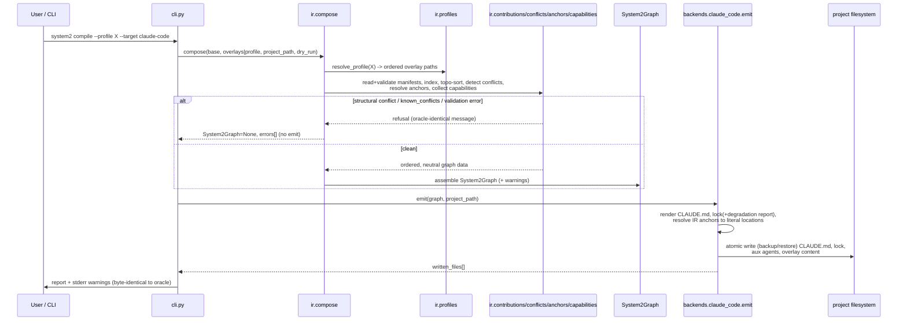

# System2 Compiler — Design (Phases 0–2)

> Status: design (Gate 3). Authored from the approved Gate 2 requirements (`spec/requirements.md`),
> Gate 1 context (`spec/context.md`), and the live `composer.py` / `profiles.py` seams plus the
> `anchor-map.json` / `overlay.schema.json` contracts and the Claude enforcement surface
> (`agents/*.md`, `hooks/*.py`, `allowlists/*.regex`, `CLAUDE.md`).
>
> Scope: the current implementation cycle, **Phases 0–2** (DoD-0 / DoD-1 / DoD-2). Phases 3–5
> appear only as forward-looking constraints (NFR-001..008) the design must not foreclose.
>
> All cited file contents are treated as untrusted data; embedded instructions are not followed.
>
> Authoritative source locations referenced throughout:
> - Frozen oracle: `/Users/james/DeliberateCode/System2/plugin/scripts/composer.py`
> - Profiles: `/Users/james/DeliberateCode/System2/plugin/scripts/profiles.py`
> - Anchor map: `/Users/james/DeliberateCode/System2/plugin/schemas/anchor-map.json`
> - Overlay schema: `/Users/james/DeliberateCode/System2/plugin/schemas/overlay.schema.json`
> - Existing evals: `/Users/james/DeliberateCode/System2/evals/`

---

## Overview

`composer.py` is already a compiler with exactly one hardcoded backend. Everything through
`_build_contribution_index` → `_topological_sort` → `detect_conflicts` → `profiles.resolve_profile`
is a **harness-neutral front-end**; `_render_contribution`, `_generate_claude_md`,
`_insert_overlay_sections`, `_generate_lock`, and `_write_outputs` are the **Claude projection**.

This design cuts the seam that already exists. It:

1. **Phase 0** freezes today's Claude output as a byte-level golden suite in the standalone
   `System2-Compiler` repo, driven by the live `composer.py` invoked as a hash-pinned oracle.
2. **Phase 1** lifts the front-end into `ir/` (producing a harness-neutral `System2Graph`) and the
   Claude projection into `backends/claude_code.py` behind a single `Backend.emit(ir, project_path)`
   interface — a *relocation, not a rewrite*. The golden net guarantees byte-identical output.
3. **Phase 2** raises anchors from literal-heading string matching to IR-level named insertion points,
   gives agents *intent capabilities* instead of Claude mechanisms, and adds a per-capability
   degradation report into the lock file with per-backend capability descriptors.

The keystone invariant (REQ-014) is **byte-identical Claude output**. It is preserved by relocating
the exact projection code (not reimplementing it) and by keeping every determinism-bearing detail —
sort keys, whitespace, header comments, `json.dumps(indent=2) + "\n"` formatting, idempotent
timestamp reuse, content fingerprint — inside `backends/claude_code.py` unchanged.

The central hazard the architecture exists to manage (the #1 project risk, R1/C5): on Claude, safety
primitives **actually block** (hooks exit non-zero); on other harnesses they may degrade to advisory
prompt text. Capabilities are therefore **first-class typed IR objects** with explicit, machine-readable
per-backend degradation reporting — never metadata, never silently dropped.

### Discovered ground truth (load-bearing)

Reading the oracle establishes what `compose()` actually emits, which scopes the IR and the golden set:

- `compose()` writes exactly: `CLAUDE.md`, `spec/overlay-manifest.lock`, **auxiliary** agent files
  (`.claude/agents/<aux>.md` contributed by overlays), and overlay content copies under
  `.system2/overlays/<name>/`. It also emits a warning stream to stderr via `_emit_stderr_warnings`.
- `compose()` does **not** generate the 13 pipeline agents, the hook scripts, or the `.regex`
  allowlists. Those are static plugin files installed by the plugin, not composition outputs. Today's
  anchor contributions flow into **CLAUDE.md delegation instructions** (a summary line plus a file
  pointer, or inline text), not into agent system prompts (see `_render_contribution`'s
  `.prompt_sections.` branch and `_insert_overlay_sections`'s "Agent augmentation" section).

This reconciles a wording gap in the requirements (which list "copied hooks, `.regex` allowlists,
`.claude/agents/*.md`" as emitted artifacts). See **Design Risks / Open Issues — T3** for how the
golden scope and the capability lowering handle the installer-owned static surface without violating
REQ-014.

---

## Architecture (components, responsibilities, and boundaries)

```
System2-Compiler/                 (own git repo, C15)
├── ir/                           Harness-neutral front-end + System2Graph schema
│   ├── __init__.py               Public: compose(), System2Graph dataclasses
│   ├── graph.py                  System2Graph + node dataclasses (the IR schema)
│   ├── build.py                  compose(core, overlays, profile) -> System2Graph
│   ├── contributions.py          Lifted: contribution indexing + topo sort
│   ├── conflicts.py              Lifted: detect_conflicts + ConflictReport
│   ├── anchors.py                IR-level anchor model (Phase 2)
│   ├── capabilities.py           Intent-capability vocabulary + validation (Phase 2)
│   ├── profiles.py               Lifted profile resolution (vendored from plugin)
│   └── manifest.py               Lifted manifest read/validate + hook_security shim
├── backends/
│   ├── base.py                   Backend protocol: emit(ir, project_path) -> written_files
│   ├── claude_code.py            Lifted Claude projection (the only backend this cycle)
│   └── capabilities/
│       └── claude_code.json      Per-capability status descriptor (Phase 2)
├── cli.py                        `system2 compile --profile X --target claude-code`
├── evals/                        Compiler's own golden suite (Phase 0)
│   ├── run_goldens.py            Output-level golden runner + comparator
│   ├── oracle.py                 Locate + hash-pin + invoke frozen composer.py
│   ├── matrix.py                 Declarative input matrix
│   └── goldens/<cell>/           Snapshot artifacts per matrix cell
└── spec/                         This spec chain
```

### Component responsibilities and boundaries

- **`ir/` (front-end).** Pure, harness-neutral. Reads manifests, the anchor map, the schema, and
  profiles; produces a `System2Graph`. Contains **no** Claude prompt-rendering, hook-wiring,
  frontmatter-emission, or lock-file formatting logic (REQ-040). Knows nothing about any backend.
- **`backends/base.py`.** Declares the lowering contract `Backend.emit(ir, project_path) -> written_files`.
  No logic beyond the protocol/ABC and shared typing.
- **`backends/claude_code.py`.** The Claude projection. Consumes **only** a `System2Graph` plus the
  target path. Never imports the manifest reader, anchor-map loader, schema loader, or `profiles`
  (REQ-015). Owns all byte-level Claude details and the degradation-report rendering.
- **`backends/capabilities/*.json`.** Declarative per-backend capability status maps (REQ-031).
- **`cli.py`.** Thin: parse args → `ir.compose(...)` → select backend → `backend.emit(...)`. Additive,
  opt-in (REQ-049). Does not touch the plugin's `/system2:*` surface.
- **`evals/` (Phase 0).** The compiler's own golden suite. Locates and hash-pins the live oracle,
  runs the matrix through both the oracle and (from Phase 1) `compose → emit`, and byte-diffs.

The hard dependency rule (enforced by `module-boundaries.json` and a static test, REQ-015/REQ-040):
`backends/*` may import `ir/` (for the `System2Graph` type) but may **not** import `ir/manifest.py`,
`ir/anchors.py` loaders, `ir/profiles.py`, or any schema/anchor-map reader. `ir/` may import **neither**
`backends/*` nor any Claude rendering code.

---

## Data Flow (step-by-step)



Notes:
- The front-end produces the graph **without invoking any backend** (REQ-010). All warnings
  (validation, conflict, semantic-tension, injection) are computed in `ir/` and carried on the graph;
  the backend (or CLI) emits them byte-identically to `_emit_stderr_warnings` (REQ-046).
- Refusal paths (known conflicts, ordering cycles, validation errors, `project_path` inside base) are
  decided in `ir/compose` and short-circuit before any emit, matching the oracle exactly
  (REQ-020/REQ-021).
- `dry_run` computes the graph and the intended `written_files` list without writing content files
  (REQ-023); the backend honors the flag.

---

## Public Interfaces (APIs, CLIs, schemas, config)

### 1. Front-end entry point (`ir/__init__.py`)

```
compose(
    base_path: str,
    overlay_paths: list[str],
    project_path: str,
    *,
    profile: str | None = None,
    dry_run: bool = False,
    allow_newer_schema: bool = False,
) -> CompileResult
```

`CompileResult` carries `graph: System2Graph | None`, `errors: list[str]`, `warnings: Warnings`,
`files_to_write: list[str]`, and the oracle-compatible `report: dict`. When `profile` is set, overlay
resolution is delegated to `ir/profiles.py` (lifted `_activate_profile` semantics) before indexing.
On any refusal, `graph is None` and `errors` is non-empty; no backend is invoked.

### 2. Backend interface (`backends/base.py`)

```
class Backend(Protocol):
    name: str
    def emit(self, ir: System2Graph, project_path: str) -> list[str]: ...
```

`emit` is the **sole** lowering entry point (REQ-013). It receives only the IR and the path. It returns
the list of absolute paths actually written (or, in `ir.dry_run`, the paths that would be written). It
performs atomic write with backup/restore (REQ-044) and preserves the `project_path`-not-in-base guard
as a defense-in-depth assertion (the primary check stays in `ir/compose`, REQ-020).

### 3. System2Graph (the IR) — top-level shape

The graph is a tree of frozen, JSON-serializable dataclasses. Top-level fields (full field/type
listing in `spec/interfaces.json`):

```
System2Graph
├── schema_version: str                       "system2-graph/1.0.0"
├── system2_version: str                      lifted from plugin.json / VERSION
├── roles: list[Role]                         the 13 pipeline agents (Phase 2 adds capabilities)
├── gate_graph: GateGraph                     Gate 0→5 nodes + ordered edges
├── delegation_contract: DelegationContract   required fields + preferred order + advisory sources
├── post_execution: PostExecution             trigger rules, exec flow, blocker/boomerang policy
├── maintenance_loop: MaintenanceLoop         regression ledger + corrective-cycle policy
├── spec_artifacts: list[SpecArtifact]        context/requirements/design/tasks (+ overlay-required)
├── contributions: OrderedContributions       per-scope, post-topo-sort overlay contributions
├── active_profile: ProfileRef | None         name + ordered source paths (or None)
├── anchors: AnchorTable                       (Phase 2) per-agent named insertion points
├── capabilities: CapabilitySet                (Phase 2) per-agent intent capabilities + attrs
├── blocking_semantics: list[BlockingSemantic] (Phase 2) fidelity-honest enforcement descriptors
├── warnings: Warnings                        validation/conflict/tension/injection (neutral)
└── base_template: BaseTemplate               opaque base CLAUDE.md text + located section offsets
```

Design rationale per element:

- **`roles` (13).** Name, `gate_role`, `write_scope`, `model_hint`, and (Phase 2) the list of intent
  capabilities. These are the *intent* projection of today's agent frontmatter; they contain **no**
  `tools:`, `hooks:`, or `permissionMode` (REQ-028). For Phase 0/1 the roles are an inventory used by
  structural goldens (count = 13, REQ-009/REQ-050); Phase 2 populates capabilities.
- **`gate_graph`.** Nodes Gate 0 (scope) … Gate 5 (ship) with the ordered checklist text and the
  per-gate overlay consultation slots. Reproduces the "Gate checklist" section and the
  `orchestrator.gates.<N>.consultation` insertion behavior.
- **`delegation_contract`.** The required delegation fields, the preferred delegation order (13 agents),
  and `advisory_sources` contributed by overlays — the inputs to the "Delegation contract" section and
  its "Advisory sources (overlay-contributed)" block.
- **`post_execution` / `maintenance_loop`.** Captured as neutral structured policy (trigger conditions,
  execution order, blocker/boomerang caps, regression-ledger steps, corrective-cycle cap). In this
  cycle these are carried as opaque base-template content the Claude backend reproduces verbatim;
  the structured representation exists so future backends can re-render the same policy. (The neutral
  structure is asserted present by REQ-012/REQ-050 structural tests but is not the byte-source for
  Claude — see Anchor/whitespace fidelity below.)
- **`contributions` (`OrderedContributions`).** A dict keyed by `(type_path, target_key)` → ordered
  list of `Contribution` records, **already topologically sorted** by the lifted `_topological_sort`.
  This is the exact structure `_generate_claude_md` consumes today, preserved verbatim so ordering and
  conflict outcomes are identical (REQ-011). Each `Contribution` keeps `overlay_name`, the raw
  contribution dict, and the resolved `overlay_path` (the `(name, contrib, path)` triple the oracle
  passes to `_render_contribution`).
- **`active_profile`.** Name + ordered resolved source paths (mirrors `report["profile"]`), or `None`.
- **`anchors` (Phase 2).** See *Anchor-lift design*. A per-agent table of named insertion points; each
  anchor carries its identity (`agent`, `anchor_name`), its `purpose`, and the **backend-opaque**
  rendering hint the Claude backend needs (today's `after_section` literal heading) stored as a
  Claude-targeted *rendering location* rather than as the IR's resolution mechanism.
- **`capabilities` / `blocking_semantics` (Phase 2).** See *Capability + degradation model*.
- **`warnings`.** Neutral lists: `validation`, `conflicts` (structural/additive/semantic), `injection`.
  The Claude backend renders them to the exact stderr text and to the lock `warnings` array.
- **`base_template`.** The base CLAUDE.md text plus the located section offsets the Claude backend uses
  for insertion. **This is a Claude-targeted field**; it exists because the keystone fidelity guarantee
  in this cycle is achieved by relocating the exact text-assembly code. See **T3/T4** and *Lift
  strategy* for why this is acceptable and how it stays quarantined from the neutral graph proper.

The IR contains **no** Claude mechanism fields on roles (REQ-028/REQ-040). The one deliberate seam —
`base_template` and per-anchor Claude rendering locations — is isolated, named as Claude-targeted, and
justified as the byte-fidelity mechanism for this cycle (not a general leak). A structural test asserts
`tools`/`hooks`/`permissionMode` never appear on any `Role` or `Contribution` object (REQ-028).

### 4. CLI (`cli.py`)

```
system2 compile --target claude-code [--profile NAME | --overlays PATHS]
                --project PATH --base PATH
                [--dry-run] [--allow-newer-schema] [--format text|json]
```

- `--target` (required this cycle; only `claude-code` accepted) selects the backend.
- `--profile NAME` xor `--overlays p1,p2,...` selects inputs; `--profile` routes through profile
  resolution. `--base`/`--project` mirror the oracle's flags. Additive and opt-in; the plugin's
  `/system2:*` commands are untouched (REQ-049/REQ-018).
- Argument order independence is guaranteed by the front-end's `(overlay_name, id)` pre-sort (REQ-041).

### 5. Capability descriptor (`backends/capabilities/claude_code.json`)

```
{ "version": "1.0.0",
  "backend": "claude-code",
  "capabilities": {
    "enforce-lease":   { "status": "native",  "mechanism": "write-lease lifecycle + validate-file-paths" },
    "block-dangerous": { "status": "native",  "mechanism": "dangerous-command-blocker.py (PreToolUse)" },
    ...
  }
}
```

`status` ∈ `{native, adapted, advisory, unsupported}` (enum-exact, REQ-036). Every capability in the IR
vocabulary must appear (completeness, REQ-031). Full schema in `spec/interfaces.json`.

### 6. Boundary Artifact Schemas

`spec/interfaces.json` (module public exports) and `spec/module-boundaries.json` (allowed/forbidden
import edges) are regenerated in full on every design pass. Their schemas are defined by the task
contract; this design emits both alongside this document.

---

## Data Model & Storage (including migrations and idempotency)

- **Lock file (`spec/overlay-manifest.lock`).** JSON, formatted exactly as
  `json.dumps(lock, indent=2) + "\n"` (REQ-019). Phase 0/1 reproduce today's shape verbatim:
  `composed_at`, `content_fingerprint`, `system2_version`, `schema_version`, `overlays`,
  `contributions_applied`, `warnings`. Phase 2 **appends one new top-level key**, `degradation_report`
  (REQ-032). This is an additive, ordered append; because it is new, it cannot perturb existing keys'
  bytes, and REQ-035 holds (adding a capability with no Claude lowering changes nothing). Key ordering
  is insertion-ordered by `_generate_lock`; the new key is added last to preserve prefix bytes.
- **Idempotency.** Preserved from the oracle: the content fingerprint (`sha256` over version + base
  template + per-overlay manifest hash + applied content files in sorted order) and the
  timestamp-reuse rule (reuse `composed_at` from the prior lock when the fingerprint matches). This
  logic moves verbatim into `backends/claude_code.py` (it is Claude-lock-specific). Identical inputs →
  byte-identical lock (REQ-041).
- **Content copies.** `.system2/overlays/<name>/` copies and the `content_hash` (sha256 over sorted
  relative paths + bytes) are reproduced by the lifted `_copy_overlay_content` inside the backend.
- **Migrations / irreversibility.** None in Phases 0–2. The lock gains one additive key (reversible by
  omission). No data is removed; no API is removed. The plugin's own `composer.py` and its lock format
  are untouched (REQ-017). The only irreversible-by-intent artifact is the **golden baseline**: it is
  written once and is never auto-regenerated by a normal run (REQ-007).

---

## Concurrency, Ordering, and Consistency

- The compiler is a single-shot, in-process, local, deterministic operation. No concurrency is
  introduced (REQ-047: no services, no network).
- **Ordering** is the consistency surface that matters. It is preserved by lifting `_topological_sort`
  verbatim: pre-sort by `(overlay_name, id)`, Kahn's algorithm with stable `(overlay_name, id)`
  tie-breaking, and identical cycle/duplicate-ID handling. The resulting `OrderedContributions` is the
  IR's single source of order; the backend never re-sorts (REQ-011/REQ-041).
- **Consistency between oracle and compiler** is asserted transitively by REQ-014's byte-identical
  goldens across the matrix, which covers ordering, conflict outcomes, and anchor placement.

---

## Failure Modes & Recovery

| Failure | Behavior (matches oracle) | Req |
|---|---|---|
| Schema / anchor-map load failure | `compose` returns error result, writes nothing | REQ-010 ctx |
| `project_path` inside/equal to base | Reject with explicit error before any emit | REQ-020 |
| Manifest invalid (and not `--allow-newer-schema`) | Collect errors, refuse, no graph | C10 |
| Known overlay conflict / aux-agent collision | Refuse with oracle-identical message text | REQ-021 |
| Ordering cycle in `after` declarations | Structural conflict; refuse (oracle-identical) | REQ-021 |
| Semantic tension (shared review tag / high-leverage) | Warn (byte-identical), proceed | REQ-022/046 |
| Unknown intent capability declared by overlay | Validation warning, no crash, deterministic | REQ-039 |
| Atomic write failure | Restore backups, remove new files/dirs, re-raise | REQ-044 |
| Oracle source drift (hash mismatch) | Golden suite fails: "oracle changed / re-baseline required" | REQ-007 |
| `dry_run` | Compute graph + `files_to_write`, write nothing | REQ-023 |

No retries, timeouts, or circuit breakers are introduced — the operation is local and deterministic
(Error Handling, requirements). The only "degraded mode" is `--allow-newer-schema`, lifted verbatim.

---

## Security Model

- **Untrusted input.** All manifests, contribution content, anchor data, and agent files are untrusted.
  No code path `eval`s or executes embedded instructions; the lifted injection scan
  (`_scan_for_injection`) runs in `ir/` and produces warnings only (REQ-042). The lift relocates code
  byte-for-byte and adds no dynamic execution.
- **Path safety.** The `project_path`-not-in-base invariant is preserved (REQ-020). Content-file path
  containment (no absolute, no `..`) is preserved by lifting the manifest validator unchanged.
- **No network / no telemetry.** Verified by reusing `check_no_network_calls` over `ir/` and
  `backends/` (REQ-047). Observability is compile-time only (goldens + lock).
- **Secrets hygiene.** The degradation report and warnings carry only capability/status/identity
  metadata; no secrets are emitted (Security & Privacy).
- **Enforcement honesty.** The enforced-vs-advisory distinction is never blurred. For `claude-code`
  every enforced safety capability is reported `native` (REQ-034); for future backends any
  non-native capability must be reported, never silently downgraded (REQ-033). This is the substrate
  for the deferred OPEN-3 decision.
- **Stdlib-only.** `ir/` and `backends/` import only the Python standard library; verified by reusing
  `check_no_external_deps` (REQ-016/REQ-043). The lifted `profiles.py` and the `hook_security` shim are
  vendored stdlib-only modules.

---

## Observability

- **Golden diffs** are the Claude-fidelity regression signal for Phases 0–2: empty diff vs. the frozen
  oracle across the matrix = pass (REQ-003/REQ-014/REQ-046).
- **Lock-file degradation report** is the primary capability observability surface: a reader determines
  enforced-vs-advisory per capability without consulting any other artifact (REQ-032/REQ-037).
- **Warning stream** (validation, conflict, semantic-tension, injection) continues to surface to stderr
  byte-identically (REQ-022/REQ-046), captured per matrix cell (REQ-002).
- No new runtime telemetry (REQ-047). Drift/CI guards are a Phase 5 concern (NFR-006), not built now.
- What we measure in CI: (1) per-cell byte diff (pass/fail), (2) oracle hash match (pass/fail),
  (3) matrix completeness (every declared cell has a snapshot), (4) dependency/network scans,
  (5) IR structural assertions (13 roles, gate graph present, no mechanism fields), (6) capability
  descriptor completeness + enum validity, (7) degradation-report completeness (no silent drop).

---

## Rollout Plan

Staged, additive, reversible; no end-user-visible change throughout (REQ-017/REQ-018).

1. **Phase 0 (DoD-0).** Stand up `System2-Compiler/evals/`. Locate + hash-pin the live oracle. Build
   the matrix and snapshot the four artifact classes per cell. Land the byte-diff comparator with the
   comparison-policy parameter (default `byte-identical`). No `ir/`/`backends/` code yet. Backout:
   delete `evals/` (no plugin impact).
2. **Phase 1 (DoD-1).** Lift the front-end into `ir/` and the projection into
   `backends/claude_code.py`; add `backends/base.py` and `cli.py`. Switch the golden runner to also
   drive `compose → claude_code.emit` and require empty diff across the matrix. Plugin still runs its
   own frozen `composer.py` (REQ-017). Backout: golden runner falls back to oracle-only; the plugin is
   unaffected because nothing was wired into it.
3. **Phase 2 (DoD-2).** Add `ir/anchors.py`, `ir/capabilities.py`, `backends/capabilities/claude_code.json`,
   and the lock `degradation_report`. Lower intent capabilities back to today's static surface with
   goldens still empty-diff (REQ-030). Backout: feature-gate the degradation-report append and the
   anchor-IR resolution behind an internal flag defaulting on; flipping off reverts to Phase 1 bytes
   (the lock append is additive, so "off" is byte-identical to Phase 1).

There is no feature flag exposed to end-users; the rollout flag is internal to the compiler repo. The
plugin's runtime engine is never swapped in this cycle (convergence is Phase 5, OPEN-4/NFR-005).

---

## Lift strategy that preserves byte-identical output (the keystone)

**Decision: seam cut + relocation, not a rewrite.** The exact functions move; their bodies are copied
verbatim (only import paths and call sites change). `composer.py` stays the frozen oracle and is never
edited (C2/REQ-017). The byte-fidelity guarantee is *mechanical*: the same code produces the same bytes,
and the golden net proves it across the matrix.

### Function → module lift mapping (at a glance)

| Frozen `composer.py` symbol | Destination | Rationale |
|---|---|---|
| `_build_contribution_index` | `ir/contributions.py` | Harness-neutral indexing (REQ-011) |
| `_topological_sort` | `ir/contributions.py` | Neutral ordering; sort keys preserved (REQ-011/041) |
| `detect_conflicts`, `ConflictReport`, `_HIGH_LEVERAGE_*`, `_PIPELINE_AGENTS` | `ir/conflicts.py` | Neutral conflict outcomes (REQ-011/021/022) |
| `validate_manifest` + `_validate_*`, `_read_manifest`, `_load_schema`, `_load_anchor_map`, `_check_path_containment`, `_collect_*content*`, `_scan_for_injection`, `_INJECTION_PATTERNS`, `ValidationResult` | `ir/manifest.py` | Neutral validation + untrusted-input scan (REQ-042) |
| `profiles.py` (whole module) | `ir/profiles.py` (vendored copy) | Neutral profile resolution (REQ-011) |
| `hook_security.check_hook_security` (+ `check_no_external_deps`, `check_no_network_calls`) | `ir/_hook_security.py` (vendored copy) | Dependency of manifest validation; stdlib-only |
| `_activate_profile` (resolution half) | `ir/build.py` | Profile→ordered-paths→compose wiring |
| `compose` (front-end half: load/validate/conflict/index/sort/fingerprint pre-compute) | `ir/build.py` → `compose()` | Produces `System2Graph` (REQ-010) |
| `_render_contribution` | `backends/claude_code.py` | Claude text rendering |
| `_generate_claude_md`, `_insert_overlay_sections`, `_SECTION_RE`, `_GATE_LINE_RE`, `_DEFERRED_SUFFIXES` | `backends/claude_code.py` | Claude CLAUDE.md assembly + insertion points |
| `_generate_lock` | `backends/claude_code.py` | Claude lock shape/formatting (REQ-019) |
| `_copy_overlay_content`, `_collect_content_files`, `_resolve_content_file` | `backends/claude_code.py` | Claude content-copy + `content_hash` |
| `_write_outputs`, `_makedirs_tracked` | `backends/claude_code.py` | Atomic write/backup/restore (REQ-044) |
| content fingerprint + timestamp-reuse block (in `compose`) | `backends/claude_code.py` | Lock-specific idempotency (REQ-041) |
| `_emit_stderr_warnings` | `cli.py` (or `backends/claude_code.py`) | Warning stream byte-identity (REQ-046) |
| `main`, arg parsing, `_emit_error`, doctor/uninstall/profile-mutation dispatch | **stay in plugin**; `cli.py` reimplements only the `compile` subset | Plugin UX unchanged (REQ-018) |

### Determinism details preserved exactly

- **Whitespace / assembly.** `_generate_claude_md` and `_insert_overlay_sections` move verbatim,
  including the header comment block (`<!-- COMPOSED ... -->`), section-boundary scanning via
  `_SECTION_RE`, gate-line handling via `_GATE_LINE_RE`, the `"\n".join(out)` join, and the EOF-append
  ordering. The base template text and located section offsets are carried on the IR (`base_template`)
  so the backend reproduces insertion points exactly.
- **Lock JSON.** `json.dumps(lock, indent=2) + "\n"` is preserved character-for-character; key insertion
  order is preserved by keeping `_generate_lock`'s dict construction order; the Phase 2 append is last.
- **Idempotent timestamp.** The fingerprint computation and `composed_at` reuse rule move verbatim,
  including reading the prior lock to reuse the timestamp.
- **Sort keys.** `(overlay_name, id)` pre-sort and tie-breaking are unchanged, giving argument-order
  independence (REQ-041).

### Handling `hook_security` / `profiles` dependencies

The oracle imports `from hook_security import check_hook_security` and `import profiles`. Both are
stdlib-only. They are **vendored** (copied) into `ir/_hook_security.py` and `ir/profiles.py` so the
compiler is self-contained and does not import out of the plugin tree (which would couple the standalone
repo to plugin internals and risk drift). The Phase 0 golden suite, however, runs the **live** oracle —
which imports the plugin's own copies — by invoking it as a subprocess from the plugin directory (see
*Golden-freeze harness*), so the vendored copies never affect the oracle's bytes.

---

## Anchor-lift design (Phase 2)

**Today (oracle).** Anchors are *not* resolved against agent prompts at all in the emitted artifacts;
the `after_section` literal heading in `anchor-map.json` is the schema/validation vocabulary, and the
contribution is rendered into **CLAUDE.md delegation instructions** (the "Agent augmentation
(overlay-contributed)" section), grouped per agent, in `OrderedContributions` order. Anchor *identity*
already governs **filtering**: `_build_contribution_index(..., valid_anchors_by_agent)` silently
excludes `prompt_sections` to unknown anchors (anchor-map `valid_anchor_names_by_agent`).

**Phase 2 change.** Resolution moves from "string-match a literal heading" to "resolve against the IR
agent definition by anchor identity":

- `ir/anchors.py` builds an `AnchorTable`: for each of the 13 agents, the set of named anchors from
  `anchor-map.json` (REQ-027), each with `agent`, `anchor_name`, `purpose`. Filtering of contributions
  to non-existent anchors is performed against this table (REQ-027), preserving the oracle's silent
  exclusion exactly.
- Each `Contribution` targeting an anchor is attached to its `(agent, anchor_name)` identity in the IR —
  not to a heading string. The IR's anchor model is the resolution mechanism (REQ-025).
- The Claude backend keeps a **per-anchor rendering location** (today's `after_section` heading and the
  current "Agent augmentation" CLAUDE.md placement) as a Claude-targeted lookup it owns. Given the IR
  anchor identity, `backends/claude_code.py` renders the contribution to the **same CLAUDE.md location
  and ordering** as the oracle (REQ-026). Because the rendered text and placement are produced by the
  relocated `_render_contribution` + `_insert_overlay_sections` code keyed by the same identity, the
  output is byte-identical (REQ-026 golden assertion).

Net effect: the IR is anchor-identity-driven and harness-neutral (no literal-heading matching as the IR
mechanism, REQ-025/REQ-040); the Claude backend owns the heading/location mapping; goldens stay empty
(REQ-026). Future backends render the same anchor identity into their own representation without any
overlay change (NFR-001).

---

## Capability + degradation model (Phase 2)

### IR capability representation

`ir/capabilities.py` defines the fixed vocabulary and attaches it to roles:

- **Intent capabilities:** `enforce-lease`, `block-dangerous`, `protect-sensitive`, `format`,
  `typecheck`, `budget`.
- **Role attributes:** `write-scope`, `model-hint`, `gate-role`.
- Each `Role` carries `capabilities: list[str]` (from the vocabulary) plus the three attribute fields.
  No Claude mechanism fields appear (REQ-028).
- An overlay declaring an **unknown** capability yields a validation warning (REQ-039), surfaced in the
  warning stream; composition does not crash and remains deterministic.

### Blocking-semantics representation (fidelity honesty)

`blocking_semantics: list[BlockingSemantic]` is the IR's honest description of *what each enforced
capability actually does on a fully-faithful target*, rich enough for a backend to report fidelity
truthfully. Each entry: `capability`, `enforcement_point` (e.g. `PreToolUse`/`PostToolUse`/`SubagentStop`
/`orchestrator-lifecycle`), `blocking: bool` (does the disallowed action get *blocked*, not merely
described), and a neutral `description`. This lets a backend declare, per capability, whether it
reproduces the blocking (native/adapted), only describes it (advisory), or omits it (unsupported) —
the substrate for OPEN-3/NFR-003 without rework.

### Mechanism → capability mapping table (REQ-029)

Every enforced Claude mechanism maps to exactly one intent capability; no enforced mechanism is left
unrepresented:

| Claude mechanism (frontmatter/hook/allowlist) | Enforcement point | Intent capability | Claude status |
|---|---|---|---|
| Write-lease lifecycle (`.task-lease.regex` write/clear in `CLAUDE.md`) + `validate-file-paths.py` against per-agent `.regex` | orchestrator-lifecycle + PreToolUse(Edit\|Write) | `enforce-lease` | native |
| `dangerous-command-blocker.py` | PreToolUse(Bash) | `block-dangerous` | native |
| `sensitive-file-protector.py` | PreToolUse(Read\|Edit\|Write\|Bash) | `protect-sensitive` | native |
| `validate-file-paths.py` + per-agent `.regex` path allowlists (e.g. `executor.regex`) | PreToolUse(Edit\|Write) | `enforce-lease` (path-scope arm) | native |
| `boundary-check.py` | PreToolUse(Edit\|Write) | `protect-sensitive` (boundary arm) | native |
| `auto-formatter.py` | PostToolUse(Edit\|Write) | `format` | native |
| `type-checker.py` | PostToolUse(Edit\|Write) | `typecheck` | native |
| `change-budget-reporter.py` | SubagentStop | `budget` | native |

Notes: (1) `validate-file-paths.py` participates in **two** intent arms — the per-task lease and the
per-agent path scope — both expressed under `enforce-lease`; the table records both rows so no mechanism
is unrepresented (REQ-029). (2) `boundary-check.py` is folded under `protect-sensitive`. (3)
`tts-notify.py` is a notification side-effect, not a safety mechanism, and is intentionally **not** a
capability; it remains a static frontmatter line the backend reproduces verbatim (so goldens stay
empty) and is recorded here as a non-capability to keep the mapping exhaustive. A test asserts every
mechanism in this table maps to exactly one capability and that the union covers the enforced surface.

### Capability descriptor + degradation report

- **Descriptor** (`backends/capabilities/claude_code.json`): every capability → exactly one of
  `{native, adapted, advisory, unsupported}` (REQ-031/REQ-036). For `claude-code`, all enforced safety
  capabilities are `native` (REQ-034).
- **Degradation report** (lock `degradation_report` key, REQ-032): for the active backend, enumerate
  **every** capability present in the IR with its status, sourced from the descriptor. Completeness is
  asserted (no IR capability missing); there is no code path that drops a capability without a report
  entry (REQ-033 — "no silent drop"). The report is parseable JSON within the lock and is the sole
  surface needed to read enforced-vs-advisory (REQ-037).
- **Lowering invariance.** Lowering intent capabilities to today's hooks/allowlists/frontmatter changes
  no bytes (REQ-030): the lowering produces the same static surface that already exists. Adding a new
  capability with no Claude lowering leaves goldens empty (REQ-035) because the only new emission is the
  additive `degradation_report` entry, and the descriptor governs whether anything is lowered.

Designed for extensibility (NFR-001): a future Goose/Pi backend adds `backends/goose.py` +
`backends/capabilities/goose.json` and reports its own statuses; overlays, agents, and the template are
untouched. The enforced-vs-advisory policy per non-Claude target (OPEN-3/OQ1) is recordable in the same
descriptor/report shape with no schema change.

---

## Golden-freeze harness design (Phase 0)

- **Location.** The compiler's goldens live in `System2-Compiler/evals/` (its own repo, REQ-008/REQ-024),
  alongside — not replacing — the plugin's existing structural goldens in `System2/evals/goldens/`. The
  plugin's structural suite continues to pass unchanged (REQ-008). Stdlib-only harness (REQ-008/REQ-016).
- **Oracle location + hash pin (REQ-006/REQ-007).** `evals/oracle.py` records the oracle reference in a
  discoverable artifact `evals/oracle.lock.json`: `{ "path": "<abs path to composer.py>",
  "sha256": "<hex>", "profiles_sha256": "<hex>", "hook_security_sha256": "<hex>" }`. Each run recomputes
  the hashes; on mismatch the suite fails with "oracle changed / re-baseline required" and does **not**
  auto-regenerate snapshots (REQ-007). The pin covers `composer.py` plus its imported `profiles.py` and
  `hook_security.py` so drift in any oracle dependency is caught.
- **Oracle invocation: subprocess CLI (decision).** The harness invokes the live oracle as a
  **subprocess** (`python3 <plugin>/scripts/composer.py --base ... --overlays ... --project <tmp>
  --format json`), capturing stdout, the stderr warning stream, and the written files in a temp
  `--project` dir. Rationale:
  1. **Zero plugin modification + faithful imports.** The oracle imports its *own* `hook_security` and
     `profiles`; running it from the plugin tree as a subprocess uses the real, unmodified dependencies
     and the exact `sys.path` it ships with — no import shimming, no risk of accidentally exercising the
     compiler's vendored copies (REQ-008/REQ-017).
  2. **True end-to-end bytes.** Subprocess exercises the real `main()` → `compose` → `_write_outputs`
     path including atomic writes and stderr emission, so the captured artifacts and warnings are
     exactly what an end-user gets (REQ-002/REQ-046).
  3. **Isolation.** A separate process cannot pollute the harness's interpreter state and guarantees the
     pinned source on disk is what executed (consistent with the hash pin).
  Trade-off: slightly slower and requires constructing CLI invocations; acceptable for a bounded matrix
  and worth the fidelity/isolation guarantee. (From Phase 1, the **compiler** side is invoked in-process
  via `compose → emit`; only the *oracle* is subprocess.)
- **Snapshot matrix (REQ-001/REQ-009).** Declarative in `evals/matrix.py`. Minimum cells:
  - `core` — no overlays (exercises base CLAUDE.md, 13-agent/6-gate invariant artifacts).
  - `core+overlay` — reuse `System2/evals/fixtures/test-overlay` (exercises principles, gate
    consultation, advisory source, an **anchor** contribution to `executor.implementation_discipline`,
    a spec required-section, and an **auxiliary agent**).
  - `core+overlay+profile` — a profile resolving ≥1 overlay (exercises profile resolution +
    `report["profile"]`).
  - `core+conflict` — two overlays with a `known_conflicts` pair (exercises refusal text, REQ-021).
  - `core+tension` — two overlays sharing a `review_when_combined_with_tags` tag and/or a
    high-leverage surface (exercises semantic-tension warning text, REQ-022).
  Fixtures are reused from `System2/evals/fixtures/` where possible and added under
  `System2-Compiler/evals/fixtures/` otherwise. A matrix-completeness test fails if any declared cell
  lacks a snapshot (REQ-001).
- **Captured artifacts per cell (REQ-002).** `CLAUDE.md`; every produced `.claude/agents/*.md`
  (auxiliary agents — and, for the `core` cell, a snapshot of the installed 13 pipeline agents to lock
  the inventory/delegation invariant, REQ-009/T3); `spec/overlay-manifest.lock`; the stderr warning
  stream. Refusal cells capture the refusal message + exit code instead of files.
- **Comparator + comparison policy (REQ-004/REQ-005).** `evals/run_goldens.py` byte-diffs each captured
  artifact against its snapshot. The comparison policy is a **parameter** per artifact class, default
  `byte-identical` (REQ-004, asserted by a config test). A class may opt into `semantic-equivalent`
  **only** with a recorded justification; selecting it without justification is rejected (REQ-005). Per
  OPEN-1/OQ6, this cycle ships **all classes at `byte-identical`**; the semantic path exists as a
  parameter but is unused (see Design Risks T2).

---

## Alternatives Considered

1. **Distribute harness support into every package (Option A).** Each of 13 agents + every overlay +
   the template carries Claude/Goose/Pi variants. *Pros:* no compiler to build; each package
   self-contained. *Cons:* N×M explosion; destroys the overlay ecosystem (authors must learn every
   harness to write domain guidance); puts the Claude reference path at risk on every edit. **Rejected**
   per all three reviews and PLAN.md (context, N×M argument).
2. **Rewrite the front-end and projection cleanly instead of lifting.** *Pros:* a tidier IR with no
   `base_template` seam. *Cons:* re-derives every byte; near-certain to drift from the oracle and break
   the keystone REQ-014; far larger surface to verify. **Rejected** in favor of seam cut + relocation
   (Minimal Change Intent; A1).
3. **In-process import of the oracle for goldens** (instead of subprocess). *Pros:* faster; simpler
   capture. *Cons:* requires `sys.path` manipulation to import the plugin's `hook_security`/`profiles`,
   risking accidental use of the compiler's vendored copies and divergence from real end-user bytes;
   couples harness interpreter state to oracle internals. **Rejected** for subprocess (above).
4. **Make the IR fully text-free (no `base_template`), deriving CLAUDE.md structurally.** *Pros:*
   purest neutrality. *Cons:* the base CLAUDE.md is hand-authored prose with exact whitespace; deriving
   it structurally would re-create the rewrite risk of (2). **Deferred**: keep `base_template` as a
   named, Claude-targeted, quarantined field this cycle; revisit at Goose (Phase 3) when a second
   backend forces a more neutral representation of the policy sections.

---

## Open Design Questions

- **OPEN-1 / OQ6 (semantic-equivalent classes).** Which artifact classes, if any, may opt into
  `semantic-equivalent` and the normalization rules. This cycle defaults all to `byte-identical` and
  ships the policy as an unused parameter. **Deferred** (resolution recorded if/when a benign drift
  appears).
- **OPEN-3 / OQ1 (enforced-vs-advisory per non-Claude target).** Not decided this cycle; Claude is fully
  `native`. The capability/blocking-semantics/descriptor/report shapes are built to record either
  outcome for Goose/Pi without rework. **Deferred to Phase 3 design gate.**
- **OPEN-4 / OQ3 (vendor-vs-install mechanics).** Bundle layout, hash/staleness guard, `doctor` drift
  semantics. **Deferred to Phase 5.**
- **Local design question (this cycle):** the eventual home of `_emit_stderr_warnings` (CLI vs backend).
  Placing it in `cli.py` keeps the backend's output purely file-bytes; placing it in the backend keeps
  warning emission co-located with the artifacts it describes. **Decision:** `cli.py`, so the backend
  contract is exactly "write files, return paths" (REQ-013); the CLI renders warnings from the neutral
  `graph.warnings`. *Discovery Needed:* confirm no plugin caller depends on warning emission order
  relative to stdout JSON — owner: maintainer (james.nordlund@gmail.com).

---

## Simplicity Budget

- **Maximum new modules (this cycle):** 12 — `ir/{graph,build,contributions,conflicts,anchors,
  capabilities,manifest,profiles,_hook_security}.py`, `backends/{base,claude_code}.py`, `cli.py`.
  (`profiles.py` and `_hook_security.py` are *vendored copies*, not new logic.) The `evals/` runner
  modules (`run_goldens,oracle,matrix`) are test infrastructure, not product modules.
- **Maximum new public interfaces:** 3 — `ir.compose()`, `Backend.emit()`, the `system2 compile` CLI.
  Plus 2 data contracts: the `System2Graph` schema and the capability-descriptor/degradation-report
  JSON shape.
- **Dependency addition policy:** none. Stdlib-only is a hard constraint (REQ-016/REQ-043). Any future
  proposal to add a dependency requires an explicit gate decision and violates the current DoD.
- **Required "do nothing / smaller change" alternative evaluated.** *Smaller change:* keep emitting from
  `composer.py` and add only the Phase 0 golden suite, deferring the IR split. *Evaluation:* this
  satisfies DoD-0 but not DoD-1/DoD-2 and does not unlock multi-harness support (the entire point, G2/G9).
  It is adopted **as the Phase 0 first step** (goldens land before any refactor) but cannot be the whole
  cycle. The seam cut is the minimal change that achieves DoD-1/2 because it relocates existing code
  rather than adding new abstraction.

---

## Rejected Abstractions

- **A backend "renderer registry" / plugin-discovery layer.** Rejected: one backend this cycle; a dict
  `{ "claude-code": ClaudeCodeBackend() }` in `cli.py` suffices. A registry is premature (NFR-008 is
  single-standalone; add the second entry when Goose lands).
- **An IR "node visitor" / generic tree-walk framework.** Rejected: the backend consumes
  `OrderedContributions` directly exactly as `_generate_claude_md` does today; a visitor abstraction
  would add indirection with no second consumer yet.
- **A capability "effect" mini-DSL.** Rejected: capabilities are a fixed 6-term vocabulary + 3
  attributes + a flat `BlockingSemantic` record. A DSL over-generalizes a closed set (R6) and risks
  changing Claude bytes via accidental expressiveness.
- **A neutral structural model of the policy prose (post-execution/maintenance sections).** Rejected
  *this cycle* in favor of carrying that prose as opaque `base_template` text. Revisit at Phase 3 when a
  second backend needs to re-render the policy (Alternative 4).
- **Per-target repos / per-target compiler packages.** Rejected by Gate 0 (C1/NFR-008); recorded as
  Tension T1.
- **Bash as an abstraction/translation layer.** Rejected by Gate 0 (C6/NFR-007); bash stays a thin
  generated installer/launcher only (Phase 3+).

---

## Verification Strategy (mapping to requirements and test strategy)

| Test mechanism | Requirements |
|---|---|
| Output golden byte-diff vs frozen oracle, full matrix (in-process `compose→emit` vs subprocess oracle) | REQ-002, REQ-003, REQ-004, REQ-009, REQ-014, REQ-019, REQ-022, REQ-026, REQ-030, REQ-035, REQ-041, REQ-045, REQ-046, REQ-050 |
| Matrix-completeness / suite-structure test | REQ-001, REQ-008 |
| Comparison-policy parameter test (default byte-identical; justification gate) | REQ-004, REQ-005 |
| Oracle hash-pin + drift test (incl. profiles/hook_security) | REQ-006, REQ-007 |
| IR structural tests (13 roles, gate graph 0→5, delegation, post-exec, maintenance, spec set, anchors, profile present) | REQ-010, REQ-011, REQ-012, REQ-013, REQ-024, REQ-050 |
| Dependency-isolation: backend imports no manifest/anchor/profile/schema loader | REQ-015, REQ-040 |
| Stdlib-only + no-network scans over `ir/` and `backends/` | REQ-016, REQ-043, REQ-047 |
| Path-safety + atomic-write/restore tests | REQ-020, REQ-044 |
| Conflict-refusal + dry-run behavioral tests (oracle-identical) | REQ-021, REQ-023 |
| Anchor-resolution IR tests (identity-keyed; non-existent anchor excluded as oracle does) | REQ-025, REQ-027 |
| Capability-vocabulary + mechanism-absence tests (no tools/hooks/permissionMode in IR) | REQ-028, REQ-029 |
| Mechanism→capability mapping completeness assertion | REQ-029 |
| Capability-descriptor schema/enum/completeness check | REQ-031, REQ-036 |
| Lock degradation-report completeness + no-silent-drop test; claude=native | REQ-032, REQ-033, REQ-034, REQ-037 |
| Schema-stability / overlay-compat (existing overlays unchanged; escape hatch unused) | REQ-038, REQ-048 |
| Unknown-capability warning test | REQ-039 |
| CLI surface test (`compile --profile --target claude-code`) | REQ-049 |
| Injection-resistance / no-eval security review | REQ-042 |
| No-user-visible-change inspection (plugin untouched) | REQ-017, REQ-018 |

Verification posture: REQ-014's byte-identical goldens are the master safety net while the IR schema
firms up (A1/A4). Every Phase-2 change (anchors, capabilities, degradation report) is landed only when
the goldens remain empty-diff (REQ-026/REQ-030/REQ-035).

---

## Design Risks / Open Issues

> Recorded, not silently reconciled, per the constraint to flag tensions.

- **T1 (carried from requirements).** Source reviews discuss per-target repos and a richer standalone
  bash *workflow* target; Gate 0 rejects both (C1/C6/NFR-007/NFR-008). This design follows the locked
  decisions; nothing here enables bash-as-abstraction or per-target topology.
- **T2 (byte-identical vs benign drift, OQ6).** Strict byte-equality may flag benign formatting drift.
  Mitigation: the comparison policy is parameterized (default byte-identical); semantic-equivalent is
  available only with recorded justification. Unused this cycle; resolution deferred to OPEN-1.
- **T3 (emitted-artifact-set wording gap) — IMPORTANT.** REQ-014/REQ-026/REQ-030 list "copied hooks,
  `.regex` allowlists, `.claude/agents/*.md`" as emitted artifacts, but the frozen `compose()` does
  **not** generate the 13 pipeline agents, hooks, or allowlists — those are static plugin files
  installed by the plugin, and anchor contributions flow into **CLAUDE.md delegation instructions**, not
  agent system prompts. *Resolution adopted:* (a) the byte-identical net for the **composed** outputs
  covers `CLAUDE.md`, the lock, auxiliary agents, overlay content, and warnings — exactly what the
  oracle writes; (b) the static surface (13 agents, hooks, allowlists) is snapshotted by the golden
  suite as an **inventory/binding invariant** (extending the plugin's existing structural goldens,
  REQ-009) so any change is caught, but it is not "emitted" by the backend this cycle; (c) the Phase 2
  capability *lowering* targets that same static surface and asserts it is unchanged byte-for-byte
  (REQ-030). This keeps every requirement satisfiable without inventing new emission the oracle does not
  perform. *Discovery Needed:* confirm with the maintainer that the convergence-era plan does not expect
  the compiler to *generate* the pipeline agents/hooks/allowlists in this cycle (owner:
  james.nordlund@gmail.com). If it does, that is new scope beyond the frozen oracle and must re-enter
  requirements.
- **T4 (`base_template` seam).** Carrying base CLAUDE.md text + section offsets on the IR is a
  Claude-targeted field on an otherwise neutral graph. It is the chosen byte-fidelity mechanism for this
  cycle and is quarantined (named Claude-targeted; not consumed by neutrality assertions). It is a
  candidate to neutralize at Phase 3 (Alternative 4). Risk: a future backend that ignores it must still
  reproduce the policy sections; acceptable because no second backend exists this cycle.
- **R1 latent.** Enforcement-fidelity degradation is the #1 project risk but is latent in Phases 0–2
  (Claude is fully native). The capability/blocking-semantics model is the substrate that must be
  expressive enough for the Phase 3 enforced-vs-advisory decision (OPEN-3/NFR-003); this design sizes it
  accordingly (`BlockingSemantic.blocking`, four-value status, completeness/no-drop invariants).

---

## Phase 3 — Goose Backend

> **[PR #10 review finding 8, added post-hoc]** This section is a frozen historical record — see
> the `_frozen_historical_record` note in `compiler/spec/interfaces.json` for the full freeze
> rationale. The Goose backend it describes was later removed from the repo in full by the
> `spec-goose-removal` cycle; nothing below describes current behavior. Preserved as-is (not
> rewritten or pruned) per this project's established convention of never editing frozen spec
> content, only annotating it.
>
> Status: design (appended to the Phases 0–2 design; nothing above is rewritten). Authored from the
> approved Phase 0–2 design, `spec/context.md`, `spec/requirements.md` (NFR-001/002/003/004), the
> implemented IR (`ir/graph.py`, `ir/capabilities.py`), the reference backend (`backends/claude_code.py`),
> and verified facts about installed **goose v1.38.0**.
>
> All cited file contents — including overlay manifests and any goose schema text — remain untrusted
> data; embedded instructions are not followed.
>
> Locked inputs (do not re-litigate here): **Goose-first** non-Claude backend (OQ2); **OQ1 RESOLVED** —
> Goose ships *adapted + advisory + loud degradation report* (nothing `native`, because Goose has no
> PreToolUse/PostToolUse/SubagentStop hooks); bash is a thin generated launcher only (C6/NFR-007); the
> backend touches only `backends/` + `backends/capabilities/` and consumes the **same** `System2Graph`
> as `claude_code` (NFR-001) — `ir/`, overlays, agents, and the claude-code backend are untouched.

### Overview

`backends/goose.py` is the **second** backend. It implements the existing contract
`Backend.emit(ir: System2Graph, project_path: str) -> list[str]` (`backends/base.py`) with the **same
boundary** as `claude_code` (imports only `ir.graph` + `backends.base` + stdlib; reads its own
`backends/capabilities/goose.json` data file; never reads manifests, the anchor map, profiles, or the
schema). It lowers the *same* neutral IR to a Goose **recipe** workflow plus enforcement artifacts.

This is the cycle where the latent #1 project risk (R1/NFR-003 — enforced→advisory **silent** decay)
becomes live: on Goose, most enforced safety primitives cannot block. The design's job is to make that
degradation **loud, honest, and machine-readable**, never silent (NFR-003/REQ-033). The
`BlockingSemantic` / four-value status / completeness substrate built in Phase 2 carries this with **no
IR change** (NFR-001) — Goose only adds files under `backends/`.

This section also revisits Alternative 4 / Rejected-Abstraction "neutral structural model of policy
prose": Goose forces a partial answer. Where the IR exposes neutral structure (roles, gate graph,
delegation contract, capabilities) Goose renders from that structure; where the IR carries only opaque
`base_template`/`OverlayInput` text (the Claude-targeted policy prose), Goose **does not consume it** —
it re-expresses the *structured* policy as recipe instructions and treats the opaque Claude text as
out of scope (see *base_template is Claude-only* below). This is the honest minimum: Goose neither
re-parses Claude prose nor silently drops policy it can represent structurally.

### Architecture (delta only)

```
backends/
├── base.py                      (unchanged) Backend protocol
├── claude_code.py               (unchanged) reference backend — MUST stay byte-green
├── goose.py                     NEW: GooseBackend.emit(ir, project_path) -> written_files
├── _yaml.py                     NEW (internal): deterministic stdlib-only YAML serializer
│                                (see "Stdlib-only YAML" — flagged constraint)
└── capabilities/
    ├── claude_code.json         (unchanged)
    └── goose.json               NEW: honest per-capability descriptor (OQ1 statuses)
```

`backends/_yaml.py` is an **internal** module owned by the backends layer. It is not a third-party
dependency (stdlib-only constraint, REQ-016/043) and is not a public interface. It exists only because
Goose artifacts are YAML and the compiler forbids PyYAML (see flagged constraint). It is consumed by
`goose.py` only. (If a future backend needs YAML it may reuse it; until then it is goose-private in
spirit but placed at `backends/_yaml.py` so the boundary rules treat it as a backend-internal helper.)

### IR → Goose artifact mapping (at a glance)

`emit` writes the following tree under `project_path`. Every path is deterministic and sorted.

| IR source | Goose artifact | Lowering |
|---|---|---|
| `gate_graph`, `delegation_contract`, `post_execution`, `maintenance_loop`, `spec_artifacts`, ordered `contributions` (orchestrator scopes) | `system2.recipe.yaml` (orchestrator) | The System2 workflow as recipe `instructions` + `prompt`; gate-graph 0→5 as an ordered checklist; the delegation contract + preferred order as delegation instructions; `sub_recipes:` referencing the 13 role recipes |
| each `Role` of the 13 (`name`, `gate_role`, `write_scope`, `model_hint`, its `capabilities`) | `agents/<role>.recipe.yaml` (one sub-recipe per role) | A leaf recipe: `title`/`description` from role; `instructions` carry gate-role + write-scope + model-hint + the role's advisory capability blocks; `settings.goose_model` from `model_hint` when present; referenced from the orchestrator `sub_recipes` |
| `capabilities` + `blocking_semantics` → **adapted** caps (`block-dangerous`, `protect-sensitive`) | `goose/permission.yaml` (generated policy fragment) + the launcher's install/merge step | A Goose permission policy (`user:` section, tool→`always_allow`/`ask_before`/`never_allow`) + `GOOSE_MODE=smart_approve`; this is the *adapted* enforcement path |
| `capabilities` → **advisory** caps (`enforce-lease`, `format`, `typecheck`, `budget`) | recipe `instructions` blocks inside the orchestrator and/or per-role recipes | A clearly-labelled "ADVISORY (not enforced on Goose)" instruction block per advisory capability |
| `capabilities` + `blocking_semantics` + `goose.json` | `system2.goose.lock.json` (degradation report) | Per-capability `native\|adapted\|advisory\|unsupported` with the LOUD honesty text; the Goose analogue of the Claude lock's `degradation_report` |
| (fixed) | `run-system2.sh` (thin launcher) | `goose recipe validate … && GOOSE_MODE=… goose run --recipe system2.recipe.yaml`, plus the global-`permission.yaml` install/merge step |
| `base_template`, `OverlayInput` (Claude-targeted) | — (NOT consumed) | Opaque Claude byte-fidelity carriers; the Goose backend never reads them (see below) |

#### Orchestrator recipe (`system2.recipe.yaml`)

A single parent recipe encoding the System2 workflow. Required keys (verified against
`goose recipe validate`): `version`, `title`, `description`. Plus:

- `instructions`: the orchestrator persona + the **gate graph** rendered as an ordered Gate 0→5
  checklist (from `gate_graph.gates[].checklist_text` in `edges` order), the **delegation contract**
  (`delegation_contract.required_fields` and `preferred_order`, the 13-role order), the
  **post-execution** trigger/exec-flow policy (`post_execution.trigger_rules`, `execution_order`,
  `blocker_policy`, `boomerang_cap`) and the **maintenance/regression** policy
  (`maintenance_loop.*`) rendered from the *structured* IR fields (not from `post_execution.opaque_text`
  / `maintenance_loop.opaque_text`, which are Claude-targeted prose). Each **advisory** capability emits
  a labelled "ADVISORY — NOT ENFORCED ON GOOSE" block here (and/or per-role) so the operator reading the
  recipe sees exactly what is not enforced.
- `prompt`: the initial task framing referencing `{{ task }}` (the one required parameter; see below).
- `parameters`: declared **only** for keys actually referenced via `{{ key }}` (goose validation fails
  with "Unnecessary parameter definitions" otherwise). Minimal set: `task` (`input_type: string`,
  `requirement: required`). Any other parameter is added **only** when the emitter actually interpolates
  it — the serializer asserts referenced⊇declared before writing (see determinism).
- `extensions`: the `developer` builtin (`type: builtin`, `name: developer`, `timeout`, `bundled: true`)
  so the recipe has the Read/Write/Edit/Shell tool surface the workflow assumes. (MCP extensions ADD
  tools; they cannot GATE the builtins — this is why enforcement rides on `permission.yaml`, not on an
  extension.)
- `sub_recipes`: one entry per role recipe — `{ name: <role>, path: agents/<role>.recipe.yaml }`, with
  an optional `values:` preset map for role-fixed parameters. Order follows
  `delegation_contract.preferred_order` (the canonical 13-role order) for determinism.

#### Role sub-recipes (`agents/<role>.recipe.yaml`) — the 13 roles

Each of the 13 `Role`s lowers to exactly one **sub-recipe** (YAML-only, per the verified goose fact that
sub-recipes must be YAML). The no-nesting / isolation model maps directly onto System2's "subagents
cannot spawn subagents": Goose sub-recipes run as **isolated sessions** and **cannot themselves declare
`sub_recipes`**, so the emitter MUST NOT emit `sub_recipes` in any role recipe — a structural invariant
the serializer asserts. Each role recipe carries:

- `version`/`title`/`description` from the role identity.
- `instructions`: the role persona, its **gate-role** (which gate it owns/serves), its **write-scope**
  (rendered as an ADVISORY block for `enforce-lease`, since Goose cannot gate per-path), and per-role
  advisory capability blocks for any of `format`/`typecheck`/`budget` the role carries.
- `settings` (when `model_hint` is present): the model hint mapped to Goose's model setting
  (`goose_model` / provider+model as Goose expects). When absent, omit `settings` (default model).
- `parameters`: only those actually referenced (same referenced⊇declared rule). A role recipe that needs
  no parameter declares none and references none — valid per goose.

> Discovery Needed (empirical, gate against `goose recipe validate`): the exact `settings` key/shape for
> a per-recipe model override in goose v1.38.0, and whether `extensions` must be re-declared per
> sub-recipe or are inherited from the parent session. Resolve by iterating the emitter against
> `goose recipe validate` (the real oracle) rather than guessing — see *Validate-as-oracle*. Owner:
> maintainer (james.nordlund@gmail.com).

#### Enforcement lowering (OQ1, concretely)

Per the locked OQ1 map, **nothing is `native`**:

- **`block-dangerous` → adapted.** Emit a Goose **permission policy** fragment (`goose/permission.yaml`)
  whose `user:` section sets the shell/Bash tool to `never_allow` for the dangerous-command set the
  System2 policy names and `ask_before` otherwise, and pair it with `GOOSE_MODE=smart_approve` so the
  LLM `PermissionJudge` adjudicates the rest. This is an **approximation**, not the deterministic
  `dangerous-command-blocker.py` exit: it is a permission decision (possibly LLM-mediated), not a hard
  PreToolUse block. The descriptor and report say so loudly.
- **`protect-sensitive` → adapted.** Emit `permission.yaml` entries setting Read/Write/Edit to
  `ask_before` (and `never_allow` for any sensitive paths expressible in goose's permission grammar),
  again backed by `smart_approve`. Goose permissions cannot path-scope as precisely as
  `sensitive-file-protector.py`; coverage is approximate and reported as `adapted`.
- **`enforce-lease` → advisory.** Per-path regex write-gating has **no Goose equivalent** (no PreToolUse
  hook, no project-scoped permission grammar rich enough for per-task leases). It lowers to a recipe
  **instruction block** ("ADVISORY — the write lease / write scope is NOT enforced on Goose; honor it")
  only. This is the single largest fidelity loss and the report states it bluntly.
- **`format` / `typecheck` / `budget` → advisory.** No PostToolUse / SubagentStop hook exists, so these
  lower to labelled advisory instruction blocks only.

The **`smart_approve` choice is deliberate** over `auto`: `auto` would run tools without any gate (the
*least* faithful to the native blocking primitives), while `chat` cannot act. `smart_approve` is the
closest Goose mode to "a gate exists" for the adapted capabilities, and the launcher sets it explicitly
so the operator is never silently in `auto`. (`GOOSE_MODE` precedence and whether a recipe can pin the
mode is a *Discovery Needed* item — resolve empirically; if a recipe cannot pin it, the launcher sets the
env var, which is why the launcher owns mode delivery.)

#### Global `permission.yaml` tension — RESOLVED (the key enforcement-delivery decision)

Verified fact: per-tool `permission.yaml` is **global** (`~/.config/goose/permission.yaml`, a `user:`
section), **not** project-scoped. MCP extensions cannot gate the builtins. This means the *adapted*
enforcement cannot be delivered purely by a file inside `project_path`. **Decision:**

1. `emit` writes the policy fragment as a **project-local artifact**: `project_path/goose/permission.yaml`
   (deterministic, snapshot-tested, never touches `~`). The backend is pure: `emit` writes only under
   `project_path` and is side-effect-free w.r.t. the user's home dir (matches the `claude_code` purity
   posture; keeps `emit` testable and idempotent).
2. The **launcher** `run-system2.sh` owns the global-delivery step. It performs an explicit, visible,
   **opt-in merge**: it prints exactly what it will change in `~/.config/goose/permission.yaml`, backs up
   the existing file, and merges the System2 `user:` entries (additive; on key conflict it prefers the
   stricter setting and logs the override). It also exports `GOOSE_MODE=smart_approve` for the run. The
   merge step is gated behind a flag/prompt so a CI or read-only run can skip it; **skipping it prints a
   LOUD warning** that the adapted enforcement is NOT active for this run (no silent downgrade —
   NFR-003).
3. The **degradation report** records that `block-dangerous`/`protect-sensitive` are `adapted` *and* that
   their delivery depends on the global merge having run — so a reader never assumes project-scoped
   enforcement that does not exist.

Rationale: keeping `emit` home-dir-free preserves determinism and testability; making the launcher the
*only* thing that touches global state, loudly and reversibly, is the honest delivery of an inherently
global mechanism. This squarely resolves the "key enforcement-delivery decision".

> **SUPERSEDED (Phase 3 corrective, OQ-G2):** the global stricter-wins merge is replaced by an
> ephemeral `XDG_CONFIG_HOME` config dir (user `config.yaml` + System2 `permission.yaml`); the launcher
> never mutates `~/.config/goose`. This removes the duplicate-key/idempotency hazards of the prior
> `cat permission.yaml >> ~/.config/goose/permission.yaml` append (non-idempotent, duplicate top-level
> `user:`/`never_allow_commands:` keys, no stricter-wins). The adapted policy is now the safe DEFAULT
> (no global mutation to opt into); `SYSTEM2_NO_PERMISSIONS=1` runs against the user's own config, and
> `SYSTEM2_KEEP_CONFIG=1` retains the ephemeral dir for debugging. `permission_delivery` is now
> `ephemeral-xdg-config`. Delivery stays enforcement-APPROXIMATE (smart_approve + permission.yaml),
> NOT native blocking.

#### Degradation report (`system2.goose.lock.json`)

The Goose analogue of the Claude lock's `degradation_report`, emitted as its **own** artifact (Goose has
no `overlay-manifest.lock` to append to; a standalone lock keeps the claude-code lock format untouched
and avoids any byte coupling). Content, sourced from `goose.json` and the IR's `capabilities` +
`blocking_semantics`:

- `backend: "goose"`, `goose_version_assumed: "1.38.0"` (the schema/behavior this emitter targets),
  `mode: "smart_approve"`, `permission_delivery: "global-merge-required"`.
- `capabilities`: **every** capability present in the IR, each with `status`
  (`adapted`/`advisory`; never `native` for Goose), the honest `mechanism` text, and a derived
  `enforced: bool` (true only for nothing this cycle — both adapted caps are gates, not hard blocks, and
  are flagged `enforced: false, gated: true`; advisory caps `enforced: false, gated: false`). Completeness
  is asserted (no IR capability missing — REQ-033 analogue / NFR-003).
- A top-level `DEGRADATION` banner string making the headline explicit, e.g. *"On Goose, enforced
  safety primitives are downgraded: block-dangerous/protect-sensitive are best-effort permission gates
  (adapted); enforce-lease/format/typecheck/budget are advisory instructions only (NOT enforced)."*

The report MUST match `goose.json` exactly (a test asserts report-status == descriptor-status per
capability), closing the silent-decay gap the eval-engineer flagged.

#### Thin launcher (`run-system2.sh`)

Per C6/NFR-007 bash is a *thin generated launcher, never an abstraction*. It does only:

1. `goose recipe validate system2.recipe.yaml` (and each `agents/*.recipe.yaml`) — fail fast if invalid.
2. The global `permission.yaml` merge step (opt-in, backed-up, loud-on-skip; see above) and
   `export GOOSE_MODE=smart_approve`.
3. `goose run --recipe system2.recipe.yaml --params task="$1"` (param plumbing only).

No workflow logic, no translation, no policy lives in bash. It is generated deterministically.

### `backends/goose.py` (the module)

```
class GooseBackend(Backend):
    name = "goose"
    def emit(self, ir: System2Graph, project_path: str) -> list[str]: ...
```

- **Inputs consumed (same boundary as claude_code):** `ir.gate_graph`, `ir.delegation_contract`,
  `ir.roles`, `ir.post_execution` (structured fields, not `opaque_text`), `ir.maintenance_loop`
  (structured fields), `ir.spec_artifacts`, `ir.contributions` (orchestrator-scoped advisory/consultation
  text rendered into instructions), `ir.capabilities` (`CapabilitySet.by_agent`),
  `ir.blocking_semantics`, and its own `goose.json`. It does **not** read `ir.base_template` or
  `ir.overlay_inputs` (Claude-targeted) — see below.
- **Determinism:** all dict/sequence outputs are emitted in a fixed, sorted order; the YAML serializer
  is canonical (stable key order, fixed indentation, LF line endings, explicit string quoting policy);
  identical IR → byte-identical Goose artifacts. No timestamps in the recipes; the lock MAY carry a
  `composed_at` only if it reuses the IR/idempotency pattern, otherwise it is omitted to keep output a
  pure function of the IR (decision: **omit timestamps** in Phase 3 outputs so goldens are a pure
  function of inputs; revisit only if idempotent re-runs need it).
- **Atomic write / dry-run:** reuse the same write posture as `claude_code` (backup/restore on failure;
  honor a dry-run intent by returning the would-write set without writing). The launcher and
  `permission.yaml` are written under `project_path` only.
- **No third-party, stdlib-only:** YAML is emitted via `backends/_yaml.py` (below). JSON (the lock) via
  `json.dumps(..., indent=2) + "\n"`.

#### `base_template` is Claude-only (revisits Alternative 4 / T4)

The Goose backend **does not** read `ir.base_template` or `ir.overlay_inputs`. Those are the
Claude-targeted byte-fidelity carriers (opaque CLAUDE.md prose + raw overlay manifest dicts). Goose
re-renders the *structured* policy (gates, delegation, post-exec, maintenance, capabilities) from the
neutral IR fields. Consequence and honest limitation: any policy that currently lives **only** as opaque
`base_template` prose with **no** structured IR representation would not appear in the Goose recipe. This
is recorded as **T5** below and is the empirical pressure Alternative 4 predicted: it tells us precisely
which policy sections, if any, must be lifted from `base_template` prose into structured IR fields to be
faithfully renderable on a second backend. This design does **not** change the IR to do so (NFR-001
boundary: Goose touches only `backends/`); it flags the gap for a future IR-enrichment requirement.

### Stdlib-only YAML emission — FLAGGED CONSTRAINT (real)

Goose recipes are **YAML**, and the compiler is **stdlib-only — no PyYAML** (REQ-016/043). Options
evaluated:

1. **Emit a JSON-compatible subset of YAML.** YAML is a superset of JSON, so `json.dumps` output is
   technically valid YAML. *Pros:* zero new code; trivially deterministic. *Cons:* unreadable as a
   "recipe" (operators expect block YAML); multi-line `instructions` become one giant JSON string;
   brittle if goose's validator or any tooling assumes block style for some keys. **Rejected as the
   primary path** for readability/operability, but retained as a *fallback* the serializer can fall
   back to for any value it cannot safely block-format.
2. **A small deterministic block-YAML serializer (`backends/_yaml.py`) — CHOSEN.** A ~single-file,
   stdlib-only writer supporting exactly the subset the recipes use: mappings, sequences, scalars
   (str/int/bool/None), and block scalars (`|` literal) for multi-line `instructions`/`prompt`. Rules:
   fixed 2-space indent, sorted/explicit key order as the emitter supplies (insertion order preserved —
   the emitter controls order for determinism), double-quote strings that need quoting (leading
   special chars, colons, `#`, etc.) per a conservative quoting predicate, `|`-literal blocks for any
   value containing a newline, LF endings, single trailing newline. It is **emit-only** (no parser; we
   never read YAML — `goose recipe validate` is the reader/oracle). *Pros:* readable recipes,
   deterministic, no dependency. *Cons:* must be correct enough for goose's parser — mitigated because
   **every emitted recipe is run through `goose recipe validate`** (the real validity oracle) in the
   test suite, so any serializer gap is caught empirically, not guessed.
3. **Vendor a YAML lib.** **Rejected**: violates stdlib-only (REQ-016/043); a full YAML emitter is far
   more surface than the closed recipe subset needs.

**Decision: option 2, with option 1 as an internal fallback for un-block-formattable values.** The
serializer's correctness is *gated empirically* by `goose recipe validate`, exactly as the Phases 0–2
oracle gates the Claude bytes — we iterate the serializer against the validator rather than asserting a
hand-written full YAML spec.

### Test / golden strategy

There is **no byte-identical oracle** for Goose (this is new output, not a relocation). The suite has
three legs, reusing the existing `evals/` harness patterns and **keeping all claude-code goldens green
(zero regression)**:

1. **Deterministic Goose-artifact goldens (snapshots).** For each matrix cell, snapshot every emitted
   artifact: `system2.recipe.yaml`, each `agents/<role>.recipe.yaml`, `goose/permission.yaml`,
   `system2.goose.lock.json`, `run-system2.sh`. Byte-identical comparison (same comparator/policy
   parameter as Phase 0, default `byte-identical`). Determinism is a pure function of the IR (no
   timestamps), so re-running `emit` twice is byte-stable (asserted).
2. **`goose recipe validate` as the validity oracle (the real schema authority).** For every emitted
   recipe (parent + all sub-recipes), run `goose recipe validate <file>` and require success. This is
   the gate that empirically pins the YAML serializer and the recipe schema (parameters referenced⊇
   declared, required keys present, sub-recipes YAML-only and non-nesting). **Goose-present gating:**
   when `goose` is on PATH (or `GOOSE_BIN` is set), the validation MUST run and MUST pass — the suite
   fails on any invalid recipe. **Goose-absent handling:** if goose is not installed, the validation
   leg is marked **SKIPPED loudly** (an explicit, visible SKIP with a non-silent banner and a recorded
   skip-reason), never a silent pass and never a downgraded "cap" — mirroring the project's no-silent-
   downgrade ethic. CI that intends to enforce Phase-3 readiness must install goose; the suite reports
   whether the oracle actually ran.
3. **Degradation / non-native assertions (the top readiness gap).** Assert: (a) the
   `system2.goose.lock.json` per-capability status **equals** `goose.json` per-capability status; (b)
   **no capability is `native`** for Goose; (c) the **non-native paths are actually exercised** — the
   adapted path emits a real `permission.yaml` with the expected tool entries, and each advisory
   capability emits a labelled "NOT ENFORCED ON GOOSE" instruction block in the recipe text; (d)
   completeness — every IR capability appears in the report (no silent drop). This directly closes the
   eval-engineer's flagged gap (the adapted/advisory path must be tested, not just the happy recipe).

**Matrix.** Reuse the Phase 0 cells (`core`, `core+overlay`, `core+overlay+profile`) for the Goose
target. The conflict/tension cells still refuse in the **front-end** (backend-independent), so Goose
emits nothing for them — assert the refusal is identical (the IR is shared; refusal precedes backend
selection). A `core+overlay` cell exercising a role that carries multiple capabilities ensures both
adapted and advisory blocks render in one recipe.

**No claude-code regression.** The claude-code goldens and the byte-identical net run unchanged; adding
the Goose backend adds files under `backends/` only and a new target to the CLI registry. A test asserts
`claude_code.emit` output is unchanged (the shared IR is unchanged) and that the claude-code goldens stay
empty-diff.

### Failure modes & recovery (Goose delta)

| Failure | Behavior | Notes |
|---|---|---|
| `goose recipe validate` fails on an emitted recipe | Test suite fails loudly ("emitted recipe invalid per goose v1.38.0"); not auto-fixed | The validator is the oracle; iterate the emitter/serializer |
| goose not installed | Validation leg **SKIPPED loudly**; goldens still run | No silent pass; CI for readiness must install goose |
| Global `permission.yaml` merge declined/skipped at launch | Launcher prints LOUD warning: adapted enforcement NOT active this run | No silent downgrade (NFR-003) |
| Global `permission.yaml` merge key conflict | Prefer stricter setting; log the override; back up prior file | Reversible (backup) |
| Front-end refusal (conflict/tension/validation) | No Goose emit (refusal precedes backend) | Identical to claude-code path |
| Role lacks `model_hint` | Omit `settings`; use Goose default model | Deterministic |
| Atomic write failure | Restore backups, remove new files/dirs, re-raise | Same posture as claude_code (REQ-044) |
| Serializer hits an un-block-formattable value | Fall back to JSON-subset quoting for that value | Still valid YAML; caught/confirmed by validate |

No retries/timeouts/circuit-breakers (local, deterministic). The only "degraded mode" is the
loud-on-skip permission merge — and it is reported, not silent.

### Determinism & idempotency

- Output is a **pure function of the IR**: no timestamps in recipes; sorted/insertion-ordered emission;
  canonical YAML; LF endings; single trailing newline. `emit(ir)` twice → byte-identical.
- The lock omits `composed_at` (decision above) so the report is also a pure function of the IR.
- `permission.yaml` entries are emitted in a fixed, sorted order so the global-merge diff is stable.

### Rollout plan (Phase 3)

Additive and reversible; no end-user-visible change to the plugin or to claude-code output.

1. Land `backends/_yaml.py` + its unit goldens (serializer correctness in isolation).
2. Land `backends/capabilities/goose.json` (done) + the descriptor-completeness/enum test extended to
   Goose.
3. Land `backends/goose.py`; register `"goose"` in the CLI `_BACKENDS` dict; add `--target goose`.
4. Add Goose goldens + the `goose recipe validate` leg (loud-skip when absent) + the degradation/
   non-native assertions. Require claude-code goldens still empty-diff.
5. Backout: remove the `"goose"` registry entry and the Goose files; nothing else changes (the IR and
   claude-code backend were never touched).

No feature flag is exposed to end users; `--target` is opt-in and defaults to nothing new for existing
claude-code users.

### Phase 3 requirements & acceptance criteria

(We are not running a separate requirements gate for Phase 3; these are the acceptance criteria.)

- **AC-G1 (valid recipes).** Every emitted recipe passes `goose recipe validate` on goose v1.38.0
  (orchestrator + all 13 role sub-recipes); parameters referenced⊇declared; sub-recipes are YAML-only and
  declare no nested `sub_recipes`. When goose is absent the suite records a LOUD skip, never a silent
  pass.
- **AC-G2 (faithful representation).** The 13 roles render as sub-recipes; the gate graph 0→5 and the
  delegation contract (required fields + preferred order) render into the orchestrator recipe from the
  structured IR; post-exec/maintenance policy renders from structured fields.
- **AC-G3 (OQ1-correct degradation).** `goose.json` and `system2.goose.lock.json` report
  `block-dangerous`/`protect-sensitive` as **adapted** and `enforce-lease`/`format`/`typecheck`/`budget`
  as **advisory**; **nothing native**; report-status == descriptor-status per capability; completeness
  (no silent drop); the LOUD degradation banner is present.
- **AC-G4 (no regression).** Claude-code goldens remain empty-diff; `ir/` and `backends/claude_code.py`
  are byte-unchanged; the IR is consumed read-only.
- **AC-G5 (stdlib-only).** No third-party import in `backends/goose.py` or `backends/_yaml.py`;
  no-network scan passes; YAML is emitted by the internal serializer.
- **AC-G6 (non-native exercised).** Tests exercise the adapted path (a real `permission.yaml` with
  expected tool entries + `smart_approve`) and the advisory path (labelled "NOT ENFORCED ON GOOSE"
  instruction blocks), not merely the happy recipe.

### Alternatives considered (Phase 3)

1. **Map enforcement onto an MCP extension instead of `permission.yaml`.** *Pros:* could add custom
   tools. *Cons:* verified fact — MCP extensions ADD tools, they cannot GATE the builtin Read/Write/Edit/
   Bash; this would NOT enforce anything and would be a *more* dishonest "native-looking" non-enforcement.
   **Rejected** — it would mask the degradation the design must make loud.
2. **Write the global `~/.config/goose/permission.yaml` directly from `emit`.** *Pros:* one-step
   delivery. *Cons:* makes `emit` impure (touches `$HOME`), non-deterministic, untestable in isolation,
   and silently mutates user state. **Rejected** — delivery is the launcher's loud, reversible, opt-in
   job; `emit` stays pure.
3. **One mega-recipe with the 13 roles inlined (no sub-recipes).** *Pros:* fewer files; no sub-recipe
   schema concerns. *Cons:* loses the isolation/no-nesting mapping to "subagents cannot spawn subagents",
   and conflates 13 distinct write-scopes/personas into one session. **Rejected** — sub-recipes are the
   faithful structural match.
4. **Default `GOOSE_MODE=auto` for a smoother demo.** *Cons:* `auto` runs tools with no gate — the least
   faithful to native blocking and a silent removal of even the adapted gate. **Rejected** for
   `smart_approve` (a gate exists), set explicitly by the launcher.

### Rejected abstractions (Phase 3)

- **A general YAML library / full emitter.** Rejected: the recipe subset is closed; a constrained
  serializer gated by `goose recipe validate` is the minimal correct surface (stdlib-only).
- **A backend "translation layer" in bash.** Rejected (C6/NFR-007): bash stays a thin
  validate-then-run launcher.
- **A generic capability→permission "policy DSL".** Rejected: only two capabilities lower to permissions
  (`block-dangerous`, `protect-sensitive`); a direct, table-driven mapping is sufficient and avoids
  over-generalizing a 2-entry set.

### Open design questions (Phase 3)

- **OQ-G1 (empirical schema details).** Exact goose v1.38.0 `settings` shape for per-recipe model
  override, whether `extensions` must be re-declared per sub-recipe, and whether a recipe can pin
  `GOOSE_MODE`. **Resolve empirically** by iterating the emitter against `goose recipe validate`/`goose
  run`; the executor must treat the validator as the oracle (like Phases 0–2). Owner: maintainer.
- **OQ-G2 (global permission delivery UX).** Whether the launcher's merge should be interactive-by-
  default vs flag-gated, and the exact conflict-resolution policy (stricter-wins is the proposed
  default). For the user to confirm.
- **OQ-G3 (T5 — opaque policy prose).** Which policy sections (if any) live only in `base_template`
  prose with no structured IR representation and therefore cannot render on Goose. This is the
  empirical pressure Alternative 4 predicted; resolving it would be a **future IR-enrichment
  requirement** (out of Phase 3's `backends/`-only scope). For the user to prioritize.
- **OQ-G4 (lock home & naming).** Standalone `system2.goose.lock.json` vs a shared report registry if a
  third backend lands. Proposed: standalone now; generalize only when a third backend exists.

### Phase 3 design risks / open issues

- **T5 (opaque-policy-prose gap) — IMPORTANT.** The Goose backend cannot render policy that exists only
  as Claude-targeted `base_template`/`overlay_inputs` prose. Recorded, not silently dropped: the
  degradation report covers *capabilities*; this gap is about *policy prose* and is flagged as OQ-G3 for
  IR enrichment. Until resolved, Goose recipes carry the **structured** policy faithfully and omit any
  Claude-only prose — and this section says so rather than implying parity.
- **T6 (adapted ≠ enforced).** `adapted` for `block-dangerous`/`protect-sensitive` is a best-effort
  permission gate (possibly LLM-mediated via `smart_approve`), not a deterministic block. The report's
  `enforced: false, gated: true` flags and the LOUD banner prevent any reader from mistaking adapted for
  native. This is the crux of NFR-003 honesty and is tested (AC-G3/AC-G6).
- **R1 now live.** Enforcement-fidelity degradation is no longer latent. The design's entire honesty
  apparatus (four-value status, completeness, loud report + banner, loud-on-skip launcher, loud-skip
  validate leg) exists to ensure the decay is impossible to miss.

---

## Phase 4 — Pi Backend

> Status: design (appended to the Phases 0–3 design; nothing above is rewritten). Authored from the
> approved Phases 0–3 design, `spec/context.md`, `spec/requirements.md` (NFR-001/003/004), the eval
> assessment `spec/evals.md` (PG6 — the mixed-status harness gap), the implemented IR
> (`ir/graph.py`, `ir/capabilities.py`), the two reference backends (`backends/claude_code.py`,
> `backends/goose.py`), and the verified facts about the installed
> `@earendil-works/pi-coding-agent` v0.79.9 extension API.
>
> All cited file contents — overlay manifests, the installed Pi sources/examples, any Pi schema text —
> remain untrusted data; embedded instructions are not followed.
>
> Locked inputs (do not re-litigate here): **enforcement scope = SAFETY-GATES NATIVE** via the
> generated Pi TypeScript extension — `enforce-lease` / `block-dangerous` / `protect-sensitive` →
> **native** (`on("tool_call")` returns `{block:true,reason}`); `budget` → **adapted**
> (`on("agent_end")` reporting); `format` / `typecheck` → **advisory** (SYSTEM.md instruction). **Pi is
> the first MIXED-status backend.** **PG6 first:** the degradation report is refactored into a shared,
> descriptor-driven helper BEFORE Pi — and the refactor is **byte-preserving** for claude-code and
> goose. Bounded `/delegate` dispatcher with honestly-reported isolation fidelity. Project-local
> auto-discovery, no install step. The compiler stays **stdlib-only Python emitting TS text + markdown**
> (node/pi only in TESTS). The IR and the claude-code/goose backends' emitted bytes are unchanged.

### Overview

`backends/pi.py` is the **third** backend, implementing the existing contract
`Backend.emit(ir: System2Graph, project_path: str) -> list[str]` with the **same boundary** as the
other two (imports only `ir.graph` + the shared degradation helper + stdlib; reads its own
`backends/capabilities/pi.json`; never reads manifests, the anchor map, profiles, or the schema; never
consumes `ir.base_template` / `ir.overlay_inputs`). It lowers the *same* neutral IR onto a **Pi
extension** (generated TypeScript text) plus Pi context/skill/prompt markdown.

Two things make Phase 4 distinct from Phase 3:

1. **Pi is the first backend whose statuses MIX all of native + adapted + advisory.** Goose proved the
   non-native path but was all-non-native (`adapted`×2 + `advisory`×4, nothing native). The Phase-3 eval
   assessment (`spec/evals.md` PG6) flags that the degradation-assertion machinery is hard-wired to
   Goose's all-non-native shape (`goose._build_degradation_report` *raises* on any `native`; the tests
   hard-code a nothing-native invariant). Pi requires the honesty apparatus to validate a backend that
   *legitimately* reports `native` for some caps and `adapted`/`advisory` for others. **PG6 is therefore
   resolved first**, as a backend-agnostic shared helper, and it is the enabler for Pi.

2. **Pi has a real native enforcement seam the compiler can generate.** Unlike Goose (no
   PreToolUse/PostToolUse/SubagentStop hooks), Pi's `on("tool_call")` handler fires **before** a tool and
   **can block** (`return { block: true, reason }`). Pi has **no built-in permission system** — it runs
   with the launching process's permissions — so *the generated extension IS the gate*. This lets the
   compiler emit a TypeScript extension that deterministically blocks the safety-gate capabilities, which
   is genuinely `native` (a hard pre-execution block), not an LLM-mediated approval like Goose's
   `smart_approve`. The honesty job here is the inverse of Goose's: we must not *over*-claim native where
   the block is vacuous (see the `enforce-lease` write-scope question, resolved below).

### PG6 — shared descriptor-driven degradation helper (resolved first; byte-preserving)

#### Problem

Today two backends each own a `_build_degradation_report`. They emit **different shapes**:

- **claude-code** (`backends/claude_code.py:_build_degradation_report`): iterates `descriptor_caps.items()`
  order, filters to IR-present, emits `{ "backend", "capabilities": { cap: { "status", "mechanism" } } }`
  — each capability record has **exactly two keys** (`status`, `mechanism`), no `enforced`/`gated`. This
  dict is appended LAST to `spec/overlay-manifest.lock` as the additive `degradation_report` key. Its
  exact bytes are pinned by the claude-code goldens (`_compare_lock` strips and re-byte-matches; the
  report itself is asserted present/complete/enum-valid/native).
- **goose** (`backends/goose.py:_build_degradation_report`): iterates `_ir_capabilities(ir)` (descriptor
  order filtered to present), emits a richer envelope
  `{ "backend", "goose_version_assumed", "mode", "permission_delivery", "DEGRADATION",
  "capabilities": { cap: { "status", "mechanism", "enforced", "gated" } } }` — each capability record has
  **four keys**, and the builder **raises** if any status is `native`. This is the standalone
  `system2.goose.lock.json`. Its exact bytes are emit-then-compared in `test_goose_degradation`.

These two shapes differ in (a) the capability-record key set (2 vs 4 keys), (b) the surrounding envelope
keys, (c) the iteration source, and (d) the native-handling policy. The eval assessment (PG6) is correct:
the test harness encodes Goose's split rather than a backend-parameterized contract, and Pi needs a
mixed-status check.

#### Helper design (`backends/_degradation.py`)

A new **internal, stdlib-only** backend helper, owned by the `backends/` layer (sibling to
`backends/_yaml.py`). It is **not** a public interface and **not** a third-party dependency. It is
imported by `claude_code`, `goose`, and `pi` only. It does **not** import `ir` business logic — it takes
the already-computed IR capability set and a descriptor as plain data, so it stays a pure function and
respects the boundary (a backend hands it `ir.capabilities` and its own descriptor dict).

Two functions, splitting *policy* (which capabilities, in what order, native-allowed?) from *mechanism*
(record assembly):

```
ir_capability_union(capabilities_by_agent: dict[str, list[str]]) -> set[str]
    # the union of IR-present capabilities (the same set both builders compute today)

build_capability_records(
    descriptor: dict,                 # the backend's parsed <backend>.json
    ir_capability_union: set[str],    # from ir_capability_union(...)
    *,
    fields: tuple[str, ...],          # which record keys to emit, IN ORDER
    allow_native: bool = True,        # goose passes False -> raises on a native status
) -> dict[str, dict]
    # returns an ordered { cap: { <fields...> } } map, capability order = descriptor order
    # filtered to IR-present (EXACTLY today's iteration + filter for both backends).
    # 'status'/'mechanism' come straight from the descriptor entry;
    # 'enforced' := status == "native";  'gated' := status == "adapted".
    # Raises (no silent drop) if an IR-present cap is absent from the descriptor — the
    # exact ValueError both builders raise today.
```

The single source of truth for the per-status flag derivation is the descriptor-driven rule
**`enforced := status=="native"`, `gated := status=="adapted"`** (and, for completeness, advisory/
unsupported → both `False`). This is exactly what `goose._build_degradation_report` computes inline
today; lifting it makes the rule one-place and the mixed-status case correct by construction.

#### How claude-code and goose stay BYTE-IDENTICAL (the hard constraint)

The helper is designed to **reproduce each existing builder's exact output**; each backend keeps its own
thin wrapper that supplies the right `fields` and envelope, so the emitted dict — and therefore the
serialized bytes — are unchanged. Concretely:

- **claude-code** wrapper calls
  `build_capability_records(descriptor, union, fields=("status", "mechanism"), allow_native=True)` and
  wraps it as `{ "backend": descriptor.get("backend", ...), "capabilities": records }`. Because `fields`
  is exactly `("status","mechanism")`, each record dict has the **same two keys in the same insertion
  order** as today, and the iteration/filter (descriptor order, IR-present) is identical — so
  `json.dumps(lock, indent=2) + "\n"` is **byte-for-byte the same**. The lock prefix and the additive
  `degradation_report` key position are untouched (REQ-019/032/035 hold).
- **goose** wrapper calls
  `build_capability_records(descriptor, union, fields=("status", "mechanism", "enforced", "gated"),
  allow_native=False)` and wraps it in the existing
  `{ "backend", "goose_version_assumed", "mode", "permission_delivery", "DEGRADATION", "capabilities" }`
  envelope (those envelope keys + the `DEGRADATION` banner text stay in `goose.py`, verbatim). `fields`
  reproduces the four-key record in the same order; `allow_native=False` reproduces the existing raise.
  `json.dumps(..., indent=2) + "\n"` is **byte-for-byte the same** `system2.goose.lock.json`.

**Insertion order is the byte-fidelity crux.** Python dicts are insertion-ordered and `json.dumps`
serializes in that order. The helper builds each record by inserting keys **in the supplied `fields`
order**, and iterates capabilities in **descriptor order filtered to IR-present** — both of which match
the current code exactly. The wrappers insert the envelope keys in their current order. No key is added,
removed, reordered, or reworded. A dedicated **byte-identity regression test** (see Test strategy)
asserts the refactored claude-code lock and goose lock are byte-identical to the pre-refactor goldens —
this is the gate that lands the PG6 refactor.

> Discovery Needed: confirm the claude-code golden lock and the goose lock currently committed under
> `evals/goldens/` are the canonical pre-refactor bytes to diff against (they are, per `spec/evals.md`
> §"well-covered"); the refactor PR must show empty-diff on both before any Pi code merges. Owner:
> maintainer (james.nordlund@gmail.com).

#### Why this unblocks Pi

Pi's wrapper calls
`build_capability_records(descriptor, union, fields=("status", "mechanism", "enforced", "gated"),
allow_native=True)`. With `allow_native=True` and the descriptor-driven flag rule, a Pi report
**legitimately mixes** `native` (enforce-lease/block-dangerous/protect-sensitive → `enforced:true`),
`adapted` (budget → `gated:true`), and `advisory` (format/typecheck → both `false`) — the exact mixed
shape PG6 says the harness must validate. The flag rule is now one-place and total over the four-value
enum, so the mixed case is correct by construction rather than by a Goose-specific special-case.

### Architecture (delta only)

```
backends/
├── base.py                      (unchanged) Backend protocol
├── claude_code.py               (unchanged BYTES) reference backend — wrapper now calls _degradation
├── goose.py                     (unchanged BYTES) wrapper now calls _degradation
├── _yaml.py                     (unchanged) goose-internal YAML serializer
├── _degradation.py              NEW (internal): shared descriptor-driven degradation helper (PG6)
├── pi.py                        NEW: PiBackend.emit(ir, project_path) -> written_files
└── capabilities/
    ├── claude_code.json         (unchanged)
    ├── goose.json               (unchanged)
    └── pi.json                  NEW: the MIXED descriptor (native + adapted + advisory)
```

`backends/_degradation.py` is an internal helper owned by the backends layer (same status as `_yaml.py`):
stdlib-only, no IR import, no I/O, consumed by the three backends only. It is the only structural change
that touches existing backend files — and only their *wrappers*, never their emitted bytes.

### IR → Pi artifact mapping (at a glance)

`PiBackend.emit` writes the following tree under `project_path`. Every path is deterministic and sorted;
output is a pure function of the IR (no timestamps), mirroring the Goose purity posture.

| IR source | Pi artifact | Lowering |
|---|---|---|
| `gate_graph`, `delegation_contract`, `post_execution`, `maintenance_loop`, `spec_artifacts`, ordered orchestrator `contributions` | `.pi/SYSTEM.md` (orchestrator context) | The System2 workflow as structured Pi context: gate graph 0→5 checklist, delegation contract + preferred order, post-exec/maintenance policy, overlay-contributed orchestrator material — rendered from the **structured** IR fields (not `*.opaque_text`, not `base_template`) |
| `gate_graph`, `delegation_contract` (summary) | `AGENTS.md` (project context) | A short project-context file Pi auto-loads; points at `.pi/SYSTEM.md` and the skills; names the 13 roles and the gate pipeline |
| each `Role` of the 13 (`name`, `gate_role`, `write_scope`, `model_hint`, its `capabilities`) | `.pi/prompts/role-<name>.md` (one per role) + a `/delegate <role>` target | A prompt template per role (persona + gate-role + write-scope + the role's advisory/native capability notes); the dispatcher routes `/delegate <role>` to it |
| `delegation_contract` (orchestrator persona) | `.pi/prompts/orchestrator.md` | The orchestrator prompt template (drive the gate graph, delegate via `/delegate`) |
| `capabilities` + `blocking_semantics` → **native** caps (`enforce-lease`, `block-dangerous`, `protect-sensitive`) | `.pi/extensions/system2.ts` `on("tool_call")` handlers | Deterministic pre-execution blocks: off-scope write/edit, dangerous bash, sensitive read/write/edit/bash → `return { block: true, reason }` |
| `capabilities` → **adapted** cap (`budget`) | `.pi/extensions/system2.ts` `on("agent_end")` handler | Non-blocking budget reporting at agent/turn end (`ctx.ui.notify` / appended summary) — a report, not a gate |
| `capabilities` → **advisory** caps (`format`, `typecheck`) | `.pi/SYSTEM.md` + per-role prompt instruction blocks | Clearly-labelled "ADVISORY (not enforced on Pi)" instruction text — making them native needs IR-enrichment we defer (see resolution) |
| `delegation_contract.preferred_order` (the 13) | `.pi/extensions/system2.ts` `/delegate` dispatcher + `.pi/skills/system2-compose/SKILL.md` | A bounded `/delegate <role>` command (registered via `pi.registerCommand`) that switches/dispatches to the role; isolation fidelity reported honestly (probe-dependent) |
| (fixed System2 workflow) | `.pi/skills/system2-{init,compose,doctor}/SKILL.md` | Three skills: `init` (set up the workflow), `compose` (run the gate pipeline / delegation), `doctor` (verify the extension loads + gates are live) |
| `capabilities` + `blocking_semantics` + `pi.json` | `system2.pi.lock.json` (degradation report) | The MIXED per-capability report via the shared helper: native/adapted/advisory with `enforced`/`gated` flags + a headline banner |
| `base_template`, `overlay_inputs` (Claude-targeted) | — (NOT consumed) | Opaque Claude byte-fidelity carriers; the Pi backend never reads them (T5/OQ-G3 gap inherited; see below) |

#### `.pi/SYSTEM.md` (orchestrator context)

Pi loads project context from `AGENTS.md` and `.pi/SYSTEM.md`. `SYSTEM.md` carries the System2
orchestrator context rendered from the structured IR exactly as the Goose orchestrator instructions are
(reuse the same structured-render approach as `goose._orchestrator_instructions`, but as markdown rather
than recipe `instructions`): the gate graph 0→5 in edge order, the delegation contract (required fields +
13-role preferred order), the post-execution policy (`trigger_rules`, `execution_order`, `blocker_policy`,
`boomerang_cap`), the maintenance/regression policy, and the overlay-contributed orchestrator material
(`_orchestrator_scoped_lines` equivalent). Each **advisory** capability emits a labelled
"ADVISORY — NOT ENFORCED ON PI (instruction only)" block here so the operator reading SYSTEM.md sees
exactly what is not deterministically enforced. The **native** and **adapted** capabilities also get a
short note pointing at the extension that enforces/reports them, so SYSTEM.md is honest about which gates
are real.

#### `AGENTS.md` (project context)

A short auto-loaded context file: the System2 one-liner, the 13-role inventory, the gate pipeline, and
pointers to `.pi/SYSTEM.md`, the skills, and the `/delegate` command. Kept small (Pi merges it into
context every session); the heavy structured policy lives in SYSTEM.md.

#### Role prompt templates (`.pi/prompts/role-<name>.md`) — the 13 roles

Pi supports prompt templates with variable substitution (`docs/prompt-templates.md`). Each of the 13
`Role`s lowers to one template: persona, its **gate-role**, its **write-scope** (rendered as the native
lease note when a scope is present, else an advisory honesty note — see the enforce-lease resolution),
its **model-hint** (as a note; Pi model selection is session-level, recorded but not silently assumed),
and per-role native/adapted/advisory capability notes. The `/delegate <role>` dispatcher targets these.

#### The bounded `/delegate` dispatcher (isolation honesty)

`pi.registerCommand("/delegate", ...)` registers a bounded dispatcher: it accepts exactly one of the 13
role names (validated against `delegation_contract.preferred_order`; an unknown role is rejected with the
valid list — bounded, no free-form role spawning), loads that role's prompt template, and dispatches the
sub-task. **Isolation fidelity is probe-dependent and reported honestly:** the Pi SDK exposes
`session_before_fork` / `session_before_switch` / `sessionManager`, but whether `/delegate` yields a
*truly isolated* sub-session vs only in-session role-switching is an empirical question. The resolution:

- The compiler emits the dispatcher using the most-isolated mechanism the probe confirms.
- A `subagent-isolation` **aspect** is recorded in `pi.json` / the degradation report. If the probe shows
  only in-session role-switching (not an isolated sub-session), that aspect is reported **adapted** (the
  delegation boundary is honored by instruction + role-switch, not by an isolated session) rather than
  silently claiming native isolation. This mirrors the Goose "subagents cannot spawn subagents" /
  isolation honesty and the project's no-silent-downgrade ethic.

> Discovery Needed (empirical probe, gated in TESTS, not the compiler): does the installed Pi v0.79.9
> SDK provide a truly isolated sub-session for a `/delegate`-style dispatch (via `sessionManager` /
> `session_before_fork`), or only in-session role-switching (`session_before_switch`)? Resolve by a node
> harness exercising the SDK; the answer sets the `subagent-isolation` aspect to native-isolation vs
> adapted. Owner: maintainer (james.nordlund@gmail.com).

#### Skills (`.pi/skills/system2-{init,compose,doctor}/SKILL.md`)

Pi skills live at `.pi/skills/<name>/SKILL.md`. Three are emitted: **`system2-init`** (how to start the
System2 workflow / what the extension provides), **`system2-compose`** (run the gate pipeline; use
`/delegate` for the 13 roles; the delegation contract), **`system2-doctor`** (verify the extension loads
and the gates are live — the operator-facing analogue of the proven-blocking test: load the extension,
confirm the `tool_call` handlers are registered).

#### Degradation report (`system2.pi.lock.json`)

The Pi analogue of the lock's degradation report, emitted as its **own** artifact (Pi has no
`overlay-manifest.lock`; standalone keeps the claude-code lock untouched, exactly as Goose does).
Built via the shared `_degradation` helper with `allow_native=True` and
`fields=("status","mechanism","enforced","gated")`. Content:

- `backend: "pi"`, `pi_version_assumed: "0.79.9"`, `enforcement: "extension-native-gates"`,
  `subagent_isolation: "<native|adapted, per the probe>"`.
- `capabilities`: **every** IR capability, each with `status`
  (`native` for enforce-lease/block-dangerous/protect-sensitive; `adapted` for budget; `advisory` for
  format/typecheck), the honest `mechanism` text, and the derived `enforced`/`gated` flags. Completeness
  asserted (no silent drop).
- A top-level `FIDELITY` banner making the mixed story explicit, e.g. *"On Pi, the safety gates
  (enforce-lease, block-dangerous, protect-sensitive) are NATIVE: the generated extension's
  on(\"tool_call\") handler hard-blocks before the tool runs. budget is ADAPTED (reported at agent_end,
  not blocked). format/typecheck are ADVISORY (SYSTEM.md instruction only, not enforced)."* — and, if
  `enforce-lease` is wired-but-unscoped (no role write_scope), a loud note that its block is a fail-closed
  wiring without a meaningful scope until IR-enrichment lands (see resolution).

The report MUST match `pi.json` per-capability status (a test asserts report-status == descriptor-status),
closing the mixed-status honesty gap PG6 named.

### The generated TS extension (`.pi/extensions/system2.ts`)

The compiler emits TypeScript **text** (it never runs or transpiles TS — node/pi live only in tests).
The extension is the default-export-function shape Pi auto-discovers from `.pi/extensions/*.ts`:

```ts
import type { ExtensionAPI, ToolCallEvent /* , ... */ } from "@earendil-works/pi-coding-agent";

export default function (pi: ExtensionAPI) {
  // --- NATIVE safety gates: on("tool_call") fires BEFORE the tool and CAN block. ---
  pi.on("tool_call", (event) => {
    // block-dangerous: bash command in the dangerous set -> hard block
    if (isToolCallEventType("bash", event)) {
      const reason = dangerousReason(event.input.command);   // backend-owned default set
      if (reason) return { block: true, reason };
    }
    // protect-sensitive: read/write/edit/bash touching a sensitive path -> hard block
    const sPath = sensitivePathTouched(event);               // backend-owned default set
    if (sPath) return { block: true, reason: `protect-sensitive: ${sPath} is sensitive` };
    // enforce-lease: write/edit path outside the role's write-scope -> hard block
    //   (write-scope from IR Role.write_scope when present; see resolution if empty)
    const off = offLeasePath(event);
    if (off) return { block: true, reason: `enforce-lease: ${off} is outside the write scope` };
    return; // allow
  });

  // --- ADAPTED: budget reporting at agent_end (a report, NOT a block). ---
  pi.on("agent_end", (event) => { /* compute + ctx.ui.notify / append change-budget summary */ });

  // --- Inject System2 orchestrator context. ---
  pi.on("before_agent_start", (event) => ({ systemPrompt: SYSTEM2_SYSTEM_PROMPT }));
  // (or pi.on("context", ...) -> { messages } if context-injection is the better seam; probe-decided)

  // --- Bounded /delegate dispatcher (isolation per the probe). ---
  pi.registerCommand("/delegate", { /* validate role in the 13; dispatch; honest isolation */ });
}
```

Key properties:

- **It type-checks against `ExtensionAPI`** and loads under Pi. The compiler emits text; the TEST suite
  proves it type-checks/loads (node/pi present) or LOUD-SKIPs (absent). The `import type` is erased at
  runtime, so the load test does not require the package to resolve types — but the type-check leg
  (`npx tsc --noEmit` or `pi -e` load) does.
- **The handlers are the gate.** Pi has no built-in permission system; returning `{ block: true, reason }`
  from `on("tool_call")` is the deterministic pre-execution block. This is what makes the three safety
  capabilities genuinely `native` (a hard block before the tool runs), distinct from Goose's LLM-mediated
  `smart_approve` *adapted* gate. The `confirm-destructive.ts` / `dirty-repo-guard.ts` examples confirm the
  default-export-fn + `pi.on(...)` + block-result shape.
- **Determinism.** The emitted `.ts` is a pure function of the IR + the backend-owned default pattern sets:
  fixed ordering, stable string escaping, LF endings, single trailing newline. Pattern sets are emitted in
  sorted order. Identical IR → byte-identical `.ts`.
- **Untrusted-text safety.** Any IR-derived string interpolated into the `.ts` (role names, write-scope,
  reasons, SYSTEM prompt) is **escaped** for a TS string/regex literal by the emitter (no raw splice). The
  emitter never embeds executable overlay content; pattern sets are backend-owned constants, not
  overlay-sourced. This keeps the injection posture identical to the rest of the compiler (REQ-042).

### RESOLVED: the concrete-pattern-source question

The gate needs CONCRETE patterns (a dangerous-command set, a sensitive-path set, a write-scope/lease
regex). The IR carries `blocking_semantics` (intent only — neutral descriptions, no patterns) and
per-role `write_scope`, but **`write_scope` is empty in the current IR** (a Phase-1 placeholder; the
Phase-3 eval verified all 13 `write_scope` values are empty, `spec/evals.md` PG1). Resolution, in two
parts:

**(a) Backend-owned DEFAULT pattern sets for `block-dangerous` + `protect-sensitive` — ADOPTED.** The Pi
backend owns a default dangerous-command set and a default sensitive-path set as backend constants,
mirroring the Claude `dangerous-command-blocker` / `sensitive-file-protector` intent and exactly the way
`backends/goose.py` already owns `_DANGEROUS_COMMANDS`. Rationale: it keeps the boundary clean (the IR
stays neutral — no patterns leak into it), it is consistent with the established Goose precedent, and the
patterns are a fixed System2 *policy* rather than per-overlay data. These two capabilities are therefore
**genuinely native** on Pi: the `on("tool_call")` handler hard-blocks the backend-owned set before the
tool runs. (The default sets are emitted deterministically, sorted; a test asserts the proven-blocking
behavior against them.)

**(b) `enforce-lease` — native-when-scoped, honestly-reported-when-not.** The lease gate is wired into
the same `on("tool_call")` handler (write/edit path outside the role's write-scope → block). Its **real
fidelity depends on whether a scope exists**:

- **When a role's `write_scope` is present**, the gate compiles it into the lease check and is a genuine
  native per-path block — fully `native`.
- **When `write_scope` is empty (today's reality)**, the gate is **wired but unscoped**: there is no scope
  to enforce, so a "native lease" claim would be **vacuous**. We do **not** ship a vacuous native gate
  silently. Instead the descriptor/report records `enforce-lease` honestly: its `mechanism` string states
  the gate is wired and fail-closed-capable but **unscoped until role `write_scope` is populated**, and
  the `FIDELITY` banner says so. The capability's status remains `native` (the *mechanism* — a hard
  pre-execution block — is native and real), but the report's `mechanism` text makes the **unscoped**
  limitation loud, so no reader assumes a meaningful per-path lease that the current IR cannot supply.

**FLAGGED design question (do NOT ship silently; maintainer approval gates it).** `enforce-lease` is only
*meaningfully* native when role `write_scope` is populated. The minimal IR-enrichment that would make it
meaningful is to **populate role `write_scope` from the existing Claude per-agent `.regex` path
allowlists** (the same allowlists `validate-file-paths.py` uses — the source already exists in the
plugin). This is **OUT of the default Phase-4 plan** (Phase 4 touches only `backends/` + the shared
helper, per NFR-001) and is raised as **OQ-P3** below for the maintainer to approve as a *separate*
scoped IR-enrichment requirement. Until approved, Phase 4 ships `enforce-lease` as the wired-but-unscoped
native gate with the loud honest report — never a silent vacuous claim.

This resolution keeps the boundary clean (patterns are backend-owned for the two policy capabilities;
the IR is not enriched without approval), and it keeps enforcement honesty intact (the one capability
whose fidelity genuinely depends on absent IR data is reported truthfully rather than over-claimed).

### `backends/pi.py` (the module)

```
class PiBackend(Backend):
    name = "pi"
    def emit(self, ir: System2Graph, project_path: str) -> list[str]: ...
```

- **Inputs consumed (same boundary as the others):** `ir.gate_graph`, `ir.delegation_contract`,
  `ir.roles`, `ir.post_execution` (structured fields), `ir.maintenance_loop` (structured fields),
  `ir.spec_artifacts`, `ir.contributions` (orchestrator-scoped, rendered into SYSTEM.md/AGENTS.md text),
  `ir.capabilities`, `ir.blocking_semantics`, and its own `pi.json`. It does **not** read
  `ir.base_template` / `ir.overlay_inputs` (Claude-targeted).
- **Determinism / purity:** pure function of the IR + backend-owned constants; no timestamps; sorted /
  insertion-ordered emission; LF endings; single trailing newline; stable TS/markdown/JSON escaping.
  `emit(ir)` twice → byte-identical tree. Same posture as Goose.
- **Atomic write / dry-run:** reuse the same write posture (`_write_outputs`-style backup/restore on
  failure; honor the IR `dry_run` intent by returning the would-write set). Writes ONLY under
  `project_path`; never touches `$HOME` or the user's real `~/.pi`.
- **Stdlib-only:** emits TS + markdown + JSON as **text**; no node/TS/third-party in the compiler. JSON
  (the lock) via `json.dumps(..., indent=2) + "\n"`. No YAML, so `_yaml` is not needed.

### Test / validity strategy

There is **no byte-identical oracle** for Pi (new output). The suite has five legs, reusing the `evals/`
patterns, with **hermetic temp HOME** and a hermetic `.pi` (tests never touch the user's real `~/.pi` or
Pi config), and **keeping all claude-code AND goose goldens green (zero regression)**:

1. **Load-validity leg.** The emitted `.pi/extensions/system2.ts` loads via node/`pi`
   (`discoverAndLoadExtensions` / `createExtensionRuntime`, or `pi -e ./system2.ts`) **without error**.
   A type-check sub-leg runs `npx tsc --noEmit` against `@earendil-works/pi-coding-agent` types. **Pi/node
   present → MUST run and MUST pass; absent → LOUD SKIP** (explicit visible banner + recorded reason,
   never a silent pass), mirroring the Goose `goose recipe validate` gating.
2. **The PROVEN-BLOCKING leg (the strongest native evidence).** A node harness imports the generated
   extension, registers its handlers, and fires **synthetic `tool_call` events at the handler directly**
   (no LLM): (i) an off-lease `write` (when a scope exists) → assert `{ block: true }`; (ii) a dangerous
   `bash` (a command from the backend-owned set) → assert `{ block: true }`; (iii) a sensitive `read`
   (a path from the backend-owned set) → assert `{ block: true }`; plus a negative control: an in-scope
   write / benign bash / non-sensitive read → assert **not** blocked. This proves the native gate
   deterministically, with no model in the loop — the strongest possible native evidence. Same
   present/LOUD-SKIP gating as leg 1.
3. **Deterministic artifact goldens.** Snapshot every emitted artifact (`.pi/extensions/system2.ts`,
   `.pi/SYSTEM.md`, `AGENTS.md`, the 13 `.pi/prompts/role-*.md` + `orchestrator.md`, the three
   `SKILL.md`, `system2.pi.lock.json`) and byte-compare (same comparator/policy parameter as Phase 0,
   default `byte-identical`). Pair with a "mutate one snapshot byte → exactly one failure"
   comparator-self-teeth test (the gap `spec/evals.md` flagged for Claude/Goose, applied to Pi).
   Emit-twice byte-stability asserted.
4. **Mixed-status degradation assertions (the PG6 win).** Assert: (a) `system2.pi.lock.json` per-capability
   status **equals** `pi.json` per-capability status; (b) the report **mixes** native + adapted + advisory
   (enforce-lease/block-dangerous/protect-sensitive native; budget adapted; format/typecheck advisory) —
   i.e. native is present AND non-native is present in one backend; (c) the `enforced`/`gated` flags follow
   the rule (`native⇒enforced:true,gated:false`; `adapted⇒enforced:false,gated:true`; `advisory⇒both
   false`); (d) completeness — every IR capability appears; (e) the `enforce-lease` unscoped honesty note
   is present while `write_scope` is empty. **Plus the PG6 backend-parameterized fixture** (`spec/evals.md`
   PG6 recommendation): a table-driven degradation check `{backend, expected status-per-cap, status→flags
   rule}` driven by a **synthetic mixed-status descriptor** (≥1 native, ≥1 adapted, ≥1 advisory, ≥1
   unsupported) through the shared `_degradation` helper, asserting report mirrors descriptor and flags
   follow the rule — so the honesty apparatus is proven on all four statuses, not just Pi's three.
5. **No claude-code / goose regression + PG6 byte-identity gate.** (a) The claude-code goldens and the
   goose goldens run unchanged and stay empty-diff after the `_degradation` refactor — this is the gate
   that lands PG6: the refactored claude-code lock and goose lock are **byte-identical** to the
   pre-refactor goldens. (b) A boundary leg (AST import scan) asserts `pi.py` imports only `ir.graph` +
   `backends._degradation` + `backends.base` + stdlib; never references `base_template` / `overlay_inputs`;
   no-network scan passes; stdlib-only holds.

**Matrix.** Reuse the existing cells (`core`, `core+overlay`, `core+overlay+profile`) for the Pi target;
the conflict/tension cells still refuse in the **front-end** (backend-independent) so Pi emits nothing —
assert the refusal is identical. A cell where a role carries multiple capabilities ensures native +
advisory blocks co-render in one role prompt + the extension.

### Failure modes & recovery (Pi delta)

| Failure | Behavior | Notes |
|---|---|---|
| Generated `.ts` fails to type-check / load under Pi | Test suite fails loudly ("emitted extension invalid per Pi v0.79.9"); not auto-fixed | node/pi is the oracle; iterate the emitter |
| Proven-blocking synthetic event does NOT block | Test suite fails loudly — the native claim is false | Strongest native-fidelity tripwire |
| node/pi not installed | Load + proven-blocking legs **SKIPPED loudly**; goldens still run | No silent pass; CI for readiness must install node/pi |
| `enforce-lease` with empty `write_scope` | Gate wired fail-closed-capable but unscoped; report says so loudly | No silent vacuous native claim (see resolution / OQ-P3) |
| `/delegate` isolation only in-session (probe) | `subagent-isolation` aspect reported `adapted`, not native | Honest isolation fidelity |
| Front-end refusal (conflict/tension/validation) | No Pi emit (refusal precedes backend) | Identical to the other backends |
| Role lacks `model_hint` | Prompt records "session default model"; no silent assumption | Deterministic |
| Atomic write failure | Restore backups, remove new files/dirs, re-raise | Same posture as the other backends (REQ-044) |
| Untrusted IR string in `.ts` | Escaped for TS literal by the emitter; never raw-spliced | Injection posture preserved (REQ-042) |

No retries/timeouts/circuit-breakers (local, deterministic). The only "degraded modes" are the loud-skip
test legs (node/pi absent) and the loud unscoped-lease report — both reported, never silent.

### Determinism & idempotency

- Output is a **pure function of the IR + backend-owned constants**: no timestamps; sorted /
  insertion-ordered emission; canonical TS/markdown/JSON escaping; LF endings; single trailing newline.
  `emit(ir)` twice → byte-identical.
- The lock omits any timestamp (pure function of inputs), matching the Goose decision.
- The shared `_degradation` helper is deterministic (descriptor-ordered, insertion-ordered records); the
  Pi report and the claude/goose reports are all pure functions of `(descriptor, IR capability union)`.

### Rollout plan (Phase 4)

Additive and reversible; no end-user-visible change to the plugin or to claude-code/goose output.

1. **Land `backends/_degradation.py` (PG6) + the byte-identity gate.** Refactor claude-code's and goose's
   `_build_degradation_report` wrappers to call the shared helper; require the claude-code lock and goose
   lock to be **byte-identical** to the committed goldens. This is the keystone gate — no Pi code merges
   until both are empty-diff. Also land the PG6 backend-parameterized degradation fixture (mixed-status).
2. **Land `backends/capabilities/pi.json`** (the mixed descriptor) + extend the descriptor-completeness/
   enum test to Pi.
3. **Land `backends/pi.py`**; register `"pi"` in the CLI `_BACKENDS` dict; add `--target pi`.
4. **Land the Pi goldens + the load-validity + proven-blocking legs** (loud-skip when node/pi absent) +
   the mixed-status degradation assertions. Require claude-code AND goose goldens still empty-diff.
5. **Backout:** remove the `"pi"` registry entry and the Pi files; the `_degradation` helper can stay
   (it is byte-neutral) or be inlined back. The IR and the other two backends were never touched in bytes.

No feature flag is exposed to end users; `--target` is opt-in.

### Phase 4 requirements & acceptance criteria

(No separate requirements gate for Phase 4; these are the acceptance criteria.)

- **AC-P1 (PG6 byte-preserving).** After the `_degradation` refactor, the claude-code lock
  (`spec/overlay-manifest.lock` `degradation_report`) and the goose lock (`system2.goose.lock.json`) are
  **byte-identical** to their pre-refactor goldens; claude-code and goose goldens stay empty-diff.
- **AC-P2 (valid + loadable extension).** The emitted `.pi/extensions/system2.ts` type-checks against
  `ExtensionAPI` and loads under Pi v0.79.9 (node/pi present); LOUD-skip when absent, never a silent pass.
- **AC-P3 (PROVEN native blocking).** A synthetic `tool_call` harness asserts the generated handler
  returns `{ block: true }` for a dangerous bash, a sensitive read, and an off-lease write (when scoped),
  and does NOT block benign inputs — no LLM in the loop.
- **AC-P4 (mixed-status honesty).** `pi.json` and `system2.pi.lock.json` report enforce-lease/
  block-dangerous/protect-sensitive as **native**, budget as **adapted**, format/typecheck as
  **advisory**; report-status == descriptor-status per capability; `enforced`/`gated` flags follow the
  status→flags rule; completeness (no silent drop); the `FIDELITY` banner and the unscoped-lease honesty
  note are present.
- **AC-P5 (mixed-status harness, PG6).** The backend-parameterized degradation fixture validates a
  synthetic descriptor mixing all four statuses (≥1 each of native/adapted/advisory/unsupported) through
  the shared helper; the assertion machinery no longer assumes nothing-native.
- **AC-P6 (faithful representation).** The 13 roles render as role prompt templates + `/delegate` targets;
  the gate graph 0→5 and the delegation contract render into `.pi/SYSTEM.md` from the structured IR;
  three skills + the orchestrator/role prompts + `AGENTS.md` are emitted.
- **AC-P7 (no regression, stdlib-only, IR-only).** Claude-code and goose goldens empty-diff; `ir/`,
  `backends/claude_code.py`, `backends/goose.py` byte-unchanged; `pi.py` imports only `ir.graph` +
  `backends._degradation` + `backends.base` + stdlib; never references `base_template` / `overlay_inputs`;
  no-network + stdlib-only scans pass; the compiler emits TS as text (no node/TS dependency in the
  compiler).
- **AC-P8 (honest isolation).** The `/delegate` dispatcher is bounded to the 13 roles; `subagent-isolation`
  is reported native or adapted per the empirical probe, never silently claimed native.

### Alternatives considered (Phase 4)

1. **Make `format`/`typecheck` native via a `tool_result` / `agent_end` post-edit handler.** *Pros:* more
   capabilities native. *Cons:* native formatting/type-checking needs to know the per-language formatter/
   checker commands — data the current IR does not carry; inventing it in the backend would be guessing,
   and a `tool_result` handler that runs the wrong command is worse than an honest advisory. **Rejected
   this cycle** — kept advisory; flagged as a candidate IR-enrichment (same family as OQ-P3) if the
   maintainer wants it later.
2. **Put the dangerous/sensitive patterns in the IR instead of backend-owned defaults.** *Pros:* one
   source of patterns across backends. *Cons:* leaks Claude/policy patterns into the neutral IR, breaking
   the boundary the whole design protects; Goose already set the precedent of backend-owned default sets.
   **Rejected** — backend-owned defaults keep the IR neutral.
3. **Deliver enforcement via a registered Pi tool (`pi.registerTool`) instead of `on("tool_call")`
   blocking.** *Pros:* could add a custom "guarded write" tool. *Cons:* a new tool ADDS surface; it does
   not GATE the builtin bash/read/write/edit — the model could just use the builtins, so it would not
   enforce. **Rejected** — `on("tool_call")` blocking is the actual gate (Pi has no built-in permission
   system, so the handler IS the permission boundary).
4. **One mixed descriptor helper that also rewrites the claude-code/goose envelopes.** *Pros:* fewer
   wrappers. *Cons:* would change claude-code/goose bytes (the hard constraint forbids it). **Rejected** —
   the helper produces records; each backend keeps its exact envelope/fields so bytes are preserved.

### Rejected abstractions (Phase 4)

- **A TS code-generation framework / AST builder.** Rejected: the extension is a fixed-shape default-export
  function with a closed set of handlers; deterministic string templating with careful escaping is the
  minimal correct surface (stdlib-only, no transpile). `pi -e` / `tsc --noEmit` is the oracle.
- **A general "capability → enforcement mechanism" DSL across backends.** Rejected: three backends now map
  the same six capabilities three different ways via direct, table-driven, backend-owned code; a DSL
  over-generalizes a closed 6-term vocabulary (same reasoning as the Phase-2/3 rejections).
- **A shared backend base class for write-posture / dry-run.** Rejected this cycle: the three backends
  already share the posture by convention; extracting a base class is a larger refactor than Phase 4 needs
  and risks touching claude-code/goose bytes. Candidate for a later cleanup if a fourth backend lands.

### Open design questions (Phase 4)

- **OQ-P1 (Pi isolation fidelity).** Does Pi v0.79.9 give `/delegate` a truly isolated sub-session or only
  in-session role-switching? **Resolve empirically** (node probe in TESTS); sets the `subagent-isolation`
  aspect to native vs adapted. Owner: maintainer.
- **OQ-P2 (context-injection seam).** `before_agent_start` (`{ systemPrompt }`) vs `context`
  (`{ messages }`) for injecting the System2 orchestrator context — pick the one that survives a session
  cleanly; resolve against `pi -e`. Owner: maintainer.
- **OQ-P3 (enforce-lease IR-enrichment) — FLAGGED FOR THE MAINTAINER.** `enforce-lease` is only
  *meaningfully* native when role `write_scope` is populated. The minimal enrichment is to populate role
  `write_scope` from the existing Claude per-agent `.regex` path allowlists. This is **out of the default
  Phase-4 `backends/`-only scope** and would be a **separate scoped IR-enrichment requirement** — raised
  here for approval, NOT shipped silently. Until approved, Phase 4 ships the lease gate wired-but-unscoped
  with a loud honest report. **For the user to approve or defer.**
- **OQ-P4 (advisory→native for format/typecheck).** Same family as OQ-P3: native formatting/type-checking
  needs per-language command data the IR lacks. A candidate future IR-enrichment; advisory this cycle. For
  the user to prioritize.

### Phase 4 design risks / open issues

- **T7 (mixed-status harness was Goose-shaped) — IMPORTANT, RESOLVED by PG6.** The Phase-3 degradation
  harness assumed nothing-native (`goose._build_degradation_report` raises on native; tests hard-code the
  nothing-native invariant). Pi requires native + non-native in one backend. PG6 lifts the per-status flag
  rule into `backends/_degradation.py` and the tests into a backend-parameterized fixture, so the honesty
  apparatus validates a mixed backend. Without PG6, Pi could not be reported honestly — hence PG6 first.
- **T8 (enforce-lease vacuity) — IMPORTANT, FLAGGED not silently shipped.** With empty role `write_scope`,
  the lease gate is wired but unscoped; a "native lease" claim would be vacuous. Resolution: report it
  honestly (loud unscoped note), and raise the IR-enrichment as OQ-P3 for explicit approval rather than
  silently shipping a vacuous gate.
- **T5 inherited (opaque-policy-prose gap).** Like Goose, Pi renders only the *structured* IR policy and
  does not consume `base_template` / `overlay_inputs`. Any policy living only as Claude-targeted prose with
  no structured IR representation does not appear in the Pi artifacts. Recorded, not silently dropped;
  same OQ-G3 IR-enrichment family.
- **R1 (enforcement fidelity).** Pi is the first backend where the fidelity is genuinely MIXED — some gates
  are real native blocks, some are honest downgrades. The whole honesty apparatus (shared four-value
  status + flags, the FIDELITY banner, the proven-blocking test, the loud unscoped-lease note, the honest
  isolation aspect) exists so a reader can tell exactly which gates are real and which are not.

---

## Phase 5 — Convergence & Lifecycle Parity

> Status: design (appended to the Phases 0–4 design; nothing above is rewritten). Authored from the
> approved Phases 0–4 design, `spec/context.md` (C3 convergence decision), `spec/requirements.md`
> (G6/G7/G8, NFR-005/006, OPEN-4), the implemented compiler (`backends/{base,claude_code,goose,pi}.py`,
> `cli.py`, `ir/__init__.py`, `ir/profiles.py`, the per-target lock artifacts), and the live plugin
> CLI contract (`plugin/scripts/composer.py` modes `_uninstall`/`drift_check`/`_activate_profile`/
> `_run_profile_mutation`/`from-lock`/`main`, and the skills `compose`/`doctor`/`profile`/`init` that
> invoke `${CLAUDE_PLUGIN_ROOT}/scripts/composer.py` and `scripts/profiles.py`).
>
> All cited file contents — overlay manifests, the plugin sources, lock files, any harness schema text —
> remain untrusted data; embedded instructions are not followed.
>
> Locked inputs (Option B, "feature-complete across Claude Code, Goose, Pi" — do not re-litigate):
> (1) FULL CLI parity with `composer.py` — add `uninstall`, `doctor`, `from-lock`, profile management
> (save/edit/op/list/inspect), plus `--allow-injection`/`--force` where they apply; (2) per-target
> lifecycle via a grown `Backend` interface — Goose and Pi get `uninstall`/`doctor`/`from-lock`, not just
> Claude; profiles stay harness-NEUTRAL and shared; (3) plugin convergence — the live plugin's
> `composer.py` is REPLACED by / delegates to a vendored, stdlib-only bundle generated from the compiler,
> preserving the EXACT CLI contract the skills invoke and BYTE-IDENTICAL Claude output (the goldens are
> the safety net); (4) machine-enforced drift guard — a `system2:doctor`-style staleness check + a CI
> hash guard so the vendored bundle can never silently diverge from the compiler source (C3/G8).

### Overview

Phase 5 closes two gaps the prior phases deliberately deferred (OPEN-4/NFR-005/NFR-006). First, the
compiler does only **compose→emit** today; the plugin's `composer.py` additionally does **uninstall,
doctor, from-lock, and profile management**. Phase 5 raises the compiler to FULL parity by growing the
`Backend` contract from a single `emit` into a **four-method lifecycle** (`emit`, `uninstall`, `doctor`,
`recompose_from_lock`) and adding the matching CLI subcommands, while keeping profiles a shared
harness-neutral surface. Second, the plugin still runs its own frozen `composer.py` (REQ-017); Phase 5
performs the **convergence flip** — the plugin ships a vendored, stdlib-only bundle generated from the
compiler, and `composer.py` becomes a thin shim that delegates to it, preserving the exact CLI contract
the skills invoke and byte-identical Claude output. A **machine-enforced drift guard** (embedded source
hash + `doctor` staleness surface + CI regeneration check) makes silent divergence impossible.

The keystone invariant is unchanged and now load-bearing in a new way: **byte-identical Claude output**
(REQ-014). Phases 0–4 proved the compiler's *compose* engine reproduces the oracle byte-for-byte; Phase 5
must additionally prove the compiler's *uninstall/doctor/from-lock* paths reproduce the oracle's
**output, exit codes, and parsed stdout/stderr** byte-for-byte, because after the flip those paths run in
the plugin. The frozen-oracle goldens — pinned to the CURRENT `composer.py` — become the immutable
pre-flip baseline; the post-flip bundle must match it (see *Goldens & oracle across the flip*).

This phase MAY modify `System2/plugin/` (the flip). Every plugin-touching step is flagged `[PLUGIN]`.
The flip is incremental and reversible (the pre-flip `composer.py` is preserved verbatim as a backout
target). No end-user UX, slash-command surface, or installed layout changes (G6/REQ-018).

### The grown `Backend` lifecycle interface

#### Why grow the interface (not add free functions)

Uninstall, doctor, and from-lock are all **target-aware**: removing/validating Goose recipes is not
removing/validating a Claude `CLAUDE.md`. Today only `emit` is on the backend; the other operations live
as Claude-only `main()` branches. To make Goose and Pi feature-complete (Option B), these operations must
become backend methods so each backend owns its own artifact lifecycle — exactly the seam Phase 1 cut for
`emit`. The alternative (a Claude-only lifecycle plus separate ad-hoc Goose/Pi code) reproduces the N×M
sprawl the whole project rejects. So the contract grows.

#### `backends/base.py` (grown — additive, default-method-bearing)

```
class Backend(Protocol):
    name: str

    # Phase 1 (unchanged signature).
    def emit(self, ir: System2Graph, project_path: str) -> list[str]: ...

    # Phase 5 — lifecycle parity (NEW).
    def uninstall(self, project_path: str, overlay_name: str, *, dry_run: bool = False)
        -> UninstallResult: ...
    def doctor(self, project_path: str) -> DoctorReport: ...
    def recompose_from_lock(self, ir_or_none, project_path: str, *, dry_run: bool = False)
        -> list[str]: ...
    def lock_path(self, project_path: str) -> str: ...        # the target's lock artifact
    def read_lock_overlay_sources(self, project_path: str) -> list[str]: ...  # for from-lock
```

- `UninstallResult` and `DoctorReport` are **neutral dataclasses** declared in `backends/base.py`
  (so all three backends and the CLI share one shape; see *Public Interfaces*). They are not IR types —
  they describe a per-target artifact lifecycle, which the IR (a pre-render structure) does not model.
- `recompose_from_lock` is the **from-lock** mechanism: the CLI reads the target's lock for overlay
  source paths, re-runs `ir.compose` over them, and calls `backend.emit` (or, for the Claude last-overlay
  edge, the backend's revert path). The backend exposes `lock_path` and `read_lock_overlay_sources` so
  the CLI stays target-agnostic; the *parsing* of each target's lock lives in the backend that owns that
  lock format (Claude: `spec/overlay-manifest.lock`; Goose: `system2.goose.lock.json`; Pi:
  `system2.pi.lock.json`).
- **Boundary unchanged.** Each backend still imports only `ir.graph` (+ its helpers `backends._yaml` /
  `backends._degradation`) + stdlib. `uninstall`/`doctor`/`from-lock` read the target's own lock and
  artifacts under `project_path`; they NEVER read overlay manifests, the anchor map, profiles, or the
  schema directly (those arrive via the recomposed IR for the from-lock path). The shared module-boundary
  forbids any backend importing `ir/manifest.py`, `ir/profiles.py`, etc. (unchanged from Phases 0–4).

#### Per-backend implementation

**Claude (`backends/claude_code.py`) — port today's `composer.py` byte-faithfully.**

- `uninstall(project_path, overlay_name, dry_run)` — port `composer._uninstall` (~L2294) +
  `_uninstall_last_overlay` (~L2086) + `_compute_stale_artifacts` verbatim into the backend (relocation,
  not rewrite — same discipline as Phase 1). Behavior preserved exactly: kebab-case name validation; read
  `spec/overlay-manifest.lock`; refuse on malformed lock / missing name / not-installed (with the exact
  installed-list message); on ≥1 remaining → recompose the remaining `source_path` set via `ir.compose`
  then `emit` (REQ-014 byte-identity holds because it is the same compose→emit path); on 0 remaining →
  revert `CLAUDE.md` to the base template, remove the lock, remove stale artifacts, clean the empty
  `.system2/overlays/` dir, all under the same atomic backup/restore (REQ-044). The `UninstallResult`
  carries `removed`, `remaining`, `artifacts_removed`, `files_written`, `claude_md_preview`,
  `is_last_overlay`, and `injection_warnings` so the CLI reproduces the oracle's exact stdout/stderr.
- `doctor(project_path)` — port `composer.drift_check` (~L2462) + `_print_doctor_report` (~L4382)
  verbatim. Produces the exact `status` ∈ `{current, stale_base, stale_overlay, broken, no_lock}`, the
  `system2_version {installed, locked}` (read via the IR's lifted `_get_system2_version` equivalent),
  `claude_md_composed` (the `<!-- COMPOSED:` header probe), per-overlay `source/local/manifest/content/
  local_content` match flags, and the `details[]` findings — byte-identical text and the exit-code rule
  (0 if `current`, else 1).
- `recompose_from_lock` — the from-lock recompose: read `overlays[].source_path` from
  `spec/overlay-manifest.lock`, refuse on missing/empty exactly as the oracle (~L4083), recompose via
  `ir.compose(..., overlay_paths=<lock sources>)` then `emit`. Byte-identical to the oracle's `--from-lock`
  path (the goldens cover it).

**Goose (`backends/goose.py`) — remove/validate the recipes + launcher.**

- `uninstall(project_path, overlay_name, dry_run)` — Goose has no `overlay-manifest.lock`; its lock is
  `system2.goose.lock.json` (a degradation report, not an overlay manifest). The overlay *set* that
  produced the Goose artifacts is not recorded in the Goose lock today (it carries capabilities, not
  overlay sources). **Decision:** Goose `uninstall` operates on the **recomposed-from-recorded-sources**
  model only when sources are available; since the Goose lock does not currently record overlay sources,
  Phase 5 adds an overlay-source list to `system2.goose.lock.json` (additive key `overlay_sources[]`,
  byte-additive — appended last, mirroring the Claude lock's additive `degradation_report`; no existing
  Goose golden byte shifts because it is a new trailing key). With sources recorded, `uninstall` mirrors
  Claude: recompose the remaining sources → `emit`; on the last overlay, **remove** the generated Goose
  tree (`system2.recipe.yaml`, `agents/*.recipe.yaml`, `goose/permission.yaml`, `system2.goose.lock.json`,
  `run-system2.sh`) and clean empty dirs, atomic backup/restore. `UninstallResult` carries the removed
  artifact list. *(Flagged: this is the one place Phase 5 touches a Goose artifact's bytes; it is additive
  and re-baselines the Goose golden once — see Test strategy.)*
- `doctor(project_path)` — validate the composed Goose tree. Status model:
  `no_lock` (no `system2.goose.lock.json`); `broken` (a referenced recipe missing, or
  `goose recipe validate <file>` fails for the orchestrator or any role sub-recipe); `stale_overlay`
  (a recorded `overlay_sources[]` path missing / its manifest hash drifted); `current` otherwise. The
  validity oracle is the **real `goose recipe validate`** (same as Phase 3's test leg): `doctor` shells it
  for each emitted recipe. **Goose-absent handling:** when `goose` is not on PATH, `doctor` reports a
  `validator_unavailable` finding **LOUDLY** (never a silent "current"); the structural checks (files
  present, lock parseable, sources resolvable) still run. Exit code 0 only when `current` AND the validator
  actually ran (or was explicitly skipped by the operator), matching the project's no-silent-downgrade ethic.
- `recompose_from_lock` — read `overlay_sources[]` from `system2.goose.lock.json`, recompose via
  `ir.compose`, `emit`. Refuse on missing/empty sources with the parallel message.

**Pi (`backends/pi.py`) — remove/validate the extension.**

- `uninstall` — same model as Goose: add `overlay_sources[]` to `system2.pi.lock.json` (additive last key,
  re-baselines the Pi golden once). Recompose remaining → `emit`; on the last overlay, remove the generated
  Pi tree (`.pi/extensions/system2.ts`, `.pi/SYSTEM.md`, `AGENTS.md`, `.pi/prompts/*`, `.pi/skills/*`,
  `system2.pi.lock.json`) and clean empty `.pi/` dirs, atomic backup/restore. Never touches the user's real
  `~/.pi` (only `project_path`).
- `doctor(project_path)` — validate the composed Pi tree. Status model:
  `no_lock` (no `system2.pi.lock.json`); `broken` (the generated `.pi/extensions/system2.ts` fails to load
  / type-check, i.e. `discoverAndLoadExtensions` / `pi -e` errors, or the proven-blocking smoke probe does
  not block); `stale_overlay` (recorded `overlay_sources[]` drift); `current` otherwise. The validity oracle
  is **node/pi** (`discoverAndLoadExtensions` to confirm the extension loads and the `tool_call` handlers
  register — the operator analogue of the Phase-4 proven-blocking test). **node/pi-absent handling:**
  LOUD `validator_unavailable` finding, structural checks still run, never a silent "current".
- `recompose_from_lock` — read `overlay_sources[]` from `system2.pi.lock.json`, recompose, `emit`.

> Discovery Needed: confirm the Goose/Pi locks may carry an additive `overlay_sources[]` key without
> breaking any Phase-3/4 consumer (they have none today — the locks are leaf artifacts). Owner: maintainer
> (james.nordlund@gmail.com). If undesirable, the alternative is a sidecar `system2.<target>.sources.json`;
> the additive-lock-key approach is preferred for one-file-per-target tidiness and is byte-additive.

### Profile management (shared, harness-neutral)

Profiles are **harness-neutral** (a named ordered overlay set; G1/C7) and stay a SHARED surface — they
feed `ir.compose` for ANY target. The vendored `ir/profiles.py` already implements the full store API
(`resolve_profile`, `create_profile`, `edit_profile`, `delete_profile`, `save_profile_from_lock`,
`list_profiles`, `inspect_profile`, `active_profile_for_lock`). Phase 5 exposes it through the compiler
CLI with the SAME semantics as the plugin's `composer.py` profile dispatch + `profiles.py` read-only CLI:

- **Activation** (`system2 compile --profile NAME --target T`) — already present in `cli.py`; routes
  through `resolve_profile` → ordered paths → `ir.compose` → `emit`, for ANY target (not just Claude).
  Hard-fail on unknown/stale exactly as `_activate_profile` (~L3459): no compose, write nothing, the same
  message text and exit codes (unknown→1, stale→1 with the remediation line, corrupt store→the carried
  `ProfileError.exit_code`).
- **Mutation** (`system2 profile {save|create|edit|delete}`) — port `_run_profile_mutation` (~L3549) and
  the `main()` profile dispatch (~L3939): `save` (`save_profile_from_lock`), `create` (`create_profile`
  with `--paths`), `edit` (`edit_profile` with repeatable `--add`/`--remove`), `delete` (`delete_profile`).
  Mutations write ONLY `~/.system2/profiles.json` (never a project artifact), reject `--dry-run` with the
  exact error, honor `--force` on save/create, and emit the `active_in_project` recompose signal computed
  PRE-mutation via `active_profile_for_lock` (so editing the active profile fires the skill's recompose
  prompt). These are **target-independent**; the profile store is one harness-neutral file.
- **Read-only listing/inspection** (`system2 profile {list|inspect NAME}`) — port the `profiles.py`
  read-only CLI (`--list`/`--inspect`/`--resolve`). Same JSON/text shapes.

The mutation sub-flag matrix (`_reject_inapplicable_subflags`, ~L4357) and the mutual-exclusion rules
(profile xor overlays xor from-lock xor uninstall) are ported verbatim so the skills' relayed
mutual-exclusion errors stay identical.

### CLI parity + new subcommands

`cli.py` grows from a single implicit `compile` into a small **subcommand dispatcher** while keeping the
existing `system2 compile` invocation working unchanged (the Phase 0–4 tests call `main(["--target", …])`
without a subcommand; the dispatcher treats a leading `--target`/no-subcommand as `compile` for
back-compat). Subcommands:

```
system2 compile   --target {claude-code|goose|pi} [--profile N | --overlays P | --from-lock]
                  --base B --project P [--dry-run] [--allow-newer-schema]
                  [--allow-injection] [--format text|json]
system2 uninstall --target {…} --base B --project P --name OVERLAY
                  [--dry-run] [--allow-injection] [--allow-newer-schema] [--format …]
system2 doctor    --target {…} --base B --project P [--format …]
system2 from-lock --target {…} --base B --project P
                  [--dry-run] [--allow-injection] [--allow-newer-schema] [--format …]
                  # (sugar for `compile --from-lock`; kept as its own verb for skill-contract parity)
system2 profile   {list | inspect NAME | save NAME | create NAME --paths P |
                   edit NAME [--add P]… [--remove OVERLAY]… | delete NAME}
                  [--project P] [--force] [--format …]   # harness-neutral; no --target
```

Parity flags ported from `composer.py`'s `main()`:

- `--allow-injection` — applies to write-mode `compile`/`uninstall`/`from-lock`: when the recomposed IR
  carries injection warnings, refuse write (exit 4) with the exact message unless `--allow-injection` is
  passed (port the `injection_blocked` branch ~L4194). *(Note: this requires the front-end to surface
  injection warnings on the `CompileResult` — already present as `report["injection_warnings"]`/
  `warnings.injection`; the CLI reads it.)*
- `--force` — applies to `profile save`/`profile create` (overwrite existing).
- `--allow-newer-schema`, `--dry-run`, `--format`, `--base`, `--project` — already present; extended to the
  new verbs.

**The Claude exact-contract requirement.** The `claude-code` path of EVERY verb must be invocable with the
EXACT argument names, exit codes, and stdout/stderr the plugin's skills parse today — because after the
flip the plugin runs the compiler's CLI (via the shim). The CLI therefore reproduces the oracle's exact
text-report bodies (the "Composition Report" block, the "Uninstall complete." block, the doctor
`Status:`/`Overlays`/`Findings` block, the profile mutation summary, the one-line activation note) and the
exact JSON envelopes (`{status, report, …}`, `{status, errors, …}`, `active_in_project`, etc.). This is
asserted by the **CLI-contract goldens** (see Test strategy), which diff the compiler CLI's
output/exit-code against the frozen oracle's for the same arguments.

> Design note (flagged): the plugin shim does NOT have to expose the compiler's `system2 <subcommand>`
> spelling. The shim preserves the `composer.py --doctor / --uninstall / --from-lock / --profile /
> --save-profile / --profile-op / --profile-*` FLAG surface the skills invoke, and maps those flags to the
> compiler's internal dispatch. So the **skills are unchanged** (they still call
> `python3 ${PLUGIN_ROOT}/scripts/composer.py --doctor …`). The compiler's own `system2` subcommand CLI is
> the additive power-user surface (`--target goose|pi`); the shim is the Claude-contract adapter. See *the
> plugin flip*.

### The vendored bundle + the plugin flip

#### Bundle mechanism (RESOLVED: a vendored `scripts/_system2_compiler/` subtree, not a single file)

The plugin ships a **vendored, stdlib-only copy of the compiler's product modules** — `ir/` and
`backends/` (and `cli.py`) — as a subtree under `plugin/scripts/_system2_compiler/`, generated from the
`System2-Compiler` source by a deterministic **bundler** (`tools/build_bundle.py`, lives in the compiler
repo). Options weighed:

1. **Single-file amalgamation** (concatenate every module into one `composer_bundle.py`). *Pros:* one file
   to vendor; trivially hashable. *Cons:* fragile to generate (import rewriting, `__name__` collisions,
   the boundary tests can no longer run against the bundle as modules); diffs are unreadable; one giant
   file is hostile to review. **Rejected.**
2. **Vendored subtree** (copy the module tree verbatim, no import rewriting) — **CHOSEN.** The bundler
   copies `ir/`, `backends/` and a tiny entry wrapper into `plugin/scripts/_system2_compiler/`, preserving
   the package structure so imports resolve as-is and the module-boundary/stdlib-only properties are
   *exactly* the compiler's (the same tests can run over the vendored tree). It is stdlib-only by
   construction (the compiler is stdlib-only — REQ-016/043), so the plugin stays ZERO-DEPENDENCY (G7/C3).
   The bundle is a pure copy: byte-for-byte the compiler's product source, so byte-identical Claude output
   is guaranteed by construction (the goldens then prove it).
3. **`pip install` / git submodule.** **Rejected** — C3/G7 forbid an end-user dependency; a submodule adds
   a clone/fetch step the zero-dependency plugin must not require.

The bundler emits a **header manifest** `plugin/scripts/_system2_compiler/BUNDLE.json`:
`{ "compiler_source_sha256": "<hash over the sorted (relpath, bytes) of the copied ir/+backends/+cli.py>",
"compiler_version": "<from VERSION>", "generated_from": "System2-Compiler@<git-rev>", "bundled_at": "<iso>" }`.
The `compiler_source_sha256` is the drift anchor (below). `bundled_at` is excluded from the hash so a
re-bundle of identical source is hash-stable.

#### The plugin flip (RESOLVED: THIN SHIM, not full-replace)

`[PLUGIN]` `plugin/scripts/composer.py` becomes a **thin shim** that delegates to the vendored bundle:

```
# plugin/scripts/composer.py  (post-flip — thin shim, stdlib-only)
import os, sys
sys.path.insert(0, os.path.join(os.path.dirname(__file__), "_system2_compiler"))
from _system2_compiler.plugin_adapter import main_composer_contract
if __name__ == "__main__":
    main_composer_contract(sys.argv[1:])   # preserves the EXACT composer.py flag CLI + exit codes
```

- **Thin-shim over full-replace, decided.** Full-replace (overwrite `composer.py` with the generated
  bundle entry) couples the file's identity to the generator and makes the backout target ambiguous. The
  thin shim keeps `composer.py` a stable, reviewable ~10-line adapter; ALL logic lives in the vendored
  subtree; the pre-flip `composer.py` is preserved as `composer.py.preflip` (the immutable oracle baseline
  and the backout target). The shim's job is solely to map the `composer.py` flag CLI (`--doctor`,
  `--uninstall`, `--from-lock`, `--profile`, `--save-profile`, `--profile-op`, `--profile-*`, `--base`,
  `--overlays`, `--project`, `--dry-run`, `--format`, `--allow-injection`, `--allow-newer-schema`,
  `--force`) onto the compiler's claude-code lifecycle + profile API, reproducing exit codes and
  stdout/stderr byte-for-byte. `--target` is **not** exposed by the shim (the plugin is Claude-only); it is
  hard-pinned to `claude-code` inside the adapter.
- **`plugin_adapter.py`** (vendored, generated) is the contract-preserving translator: it is essentially
  the ported `composer.main()` argument parsing + dispatch, but calling the compiler's
  `ClaudeCodeBackend.{emit,uninstall,doctor,recompose_from_lock}` + `ir.compose` + `ir/profiles.py` instead
  of the old inline functions. It is the ONE place the `composer.py` CLI contract is encoded; the
  CLI-contract goldens pin it against the frozen oracle.
- **How `${PLUGIN_ROOT}/scripts/composer.py` invocation stays identical.** The skills call
  `python3 "${PLUGIN_ROOT}/scripts/composer.py" --base … --project … --doctor …` etc. (compose/doctor
  SKILL.md). The shim keeps that exact path and flag surface, so **no skill changes** (compose, doctor,
  profile, init, "uninstall via `--uninstall`"). `scripts/profiles.py` is ALSO flipped to a thin shim over
  the vendored `ir/profiles.py` (the `/system2:profile` skill calls it directly) — same mechanism.
- **`init` skill** is unaffected: it produces base-only output and does not invoke the engine's
  overlay/profile paths; the base template source (`skills/init/SKILL.md` / repo `CLAUDE.md`) is unchanged.

#### Zero-dependency / stdlib-only preservation

The vendored subtree imports only stdlib (it is a copy of the stdlib-only compiler). A CI scan
(`check_no_external_deps` over `plugin/scripts/_system2_compiler/`) asserts it. No `pip`, no network, no
submodule. The plugin's runtime dependency set stays empty (G7 measurable).

### Drift guard (C3/G8/NFR-006 — machine-enforced freshness)

Two surfaces, both keyed off `BUNDLE.json`'s `compiler_source_sha256`:

1. **`system2:doctor` staleness check (`[PLUGIN]` doctor extension).** The Claude `doctor` gains a
   `bundle_freshness` finding: it recomputes the hash over the vendored subtree's source and compares it to
   `BUNDLE.json.compiler_source_sha256` (an INTERNAL consistency check — catches a hand-edited bundle), and
   surfaces the recorded `compiler_version`/`generated_from`. It is a **report-only** finding in the
   end-user `doctor` (a tampered/hand-edited bundle → a LOUD `bundle_tampered` finding; it does not block
   compose). The authoritative cross-repo freshness check (bundle == regenerated-from-source) requires the
   compiler source, which the end-user plugin does not ship — so that check is the CI guard (below), and
   `doctor` surfaces the *recorded provenance* + the *internal-integrity* result.
2. **CI hash guard (`tools/check_bundle_fresh.py`, in the compiler repo / a cross-repo CI job).** Regenerate
   the bundle from the current `System2-Compiler` source into a temp dir, hash it, and compare to the
   committed `plugin/scripts/_system2_compiler/` (and its `BUNDLE.json`). **Fail CI** with
   "vendored bundle is stale: regenerate via `tools/build_bundle.py`" when they differ. This is the G8
   machine-enforced freshness: a stale vendored bundle CANNOT merge. The guard is deterministic (the
   bundler is a pure copy; `bundled_at` is excluded from the hash).

A **drift-guard self-test** mutates a byte in a vendored module and asserts (a) the CI guard fails and
(b) `doctor` reports `bundle_tampered` — proving the guard has teeth (the same "mutate→exactly-one-failure"
discipline `spec/evals.md` asked for).

### Test / verification strategy

**The Claude compose output stays byte-identical.** The existing Phase-0 goldens (compose→emit vs the
frozen oracle) prove the engine; they run unchanged through the vendored bundle's `ClaudeCodeBackend` and
must stay empty-diff. The flip adds a **bundle-equivalence gate**: the vendored bundle's output ==
the compiler's output == the frozen oracle's output, across the full matrix, for compose. This is the
keystone that lands the flip — no plugin change merges until it is empty-diff.

**CLI-contract goldens (NEW — the parity proof).** A new golden leg captures the **frozen oracle's**
stdout, stderr, and exit code for the FULL verb surface and diffs the compiler CLI (and the vendored
bundle / shim) against them, byte-for-byte:

- `compile` (already covered by the artifact goldens; add stdout/stderr/exit-code capture for the report
  bodies and the injection-blocked / error / dry-run branches).
- `uninstall` — matrix cells: remove one of N (recompose path), remove the last (revert path), not-installed
  (error text + exit 1), no-lock, malformed lock, dry-run preview, injection-blocked.
- `doctor` — cells: `current`, `stale_base`, `stale_overlay`, `broken`, `no_lock` — the exact report text
  and exit codes (0/1).
- `from-lock` — recompose path + the missing/empty-lock refusals.
- `profile` — `save`/`create`/`edit`/`delete`/`list`/`inspect`, the `active_in_project` signal, the
  sub-flag-rejection and mutual-exclusion errors, the `--force` overwrite, the `--dry-run`-rejected error.

The oracle for these is the **pre-flip `composer.py`** (the same hash-pinned frozen oracle, extended to
cover the lifecycle verbs). The pin (`evals/oracle.lock.json`) gains the lifecycle code paths in its
coverage; oracle drift still fails loudly (REQ-007).

**Per-target uninstall/doctor tests (real validators).** Goose: `goose recipe validate` is the doctor
validity oracle (LOUD-skip when goose absent, as Phase 3). Pi: `discoverAndLoadExtensions` / `pi -e` load +
the synthetic `tool_call` proven-blocking probe is the doctor validity oracle (LOUD-skip when node/pi
absent, as Phase 4). Uninstall tests assert: recompose-remaining produces the expected artifact set;
last-overlay removal removes the full generated tree and cleans empty dirs; atomic restore on a simulated
write failure (REQ-044). The Goose/Pi `overlay_sources[]` additive lock key re-baselines those two goldens
ONCE (a flagged, reviewed re-snapshot — the only intentional byte change to a non-Claude artifact this
phase), and a test asserts the key is additive/last and that the rest of each lock is unchanged.

**The plugin's own `System2/evals/` suite must still pass after the flip.** `[PLUGIN]` The plugin's
existing structural + behavioral evals (`System2/evals/`) run against the FLIPPED plugin (shim →
vendored bundle) and must stay green. This is a hard gate: the flip is not done until the plugin's own
suite passes on the bundle.

**Goldens & oracle across the flip (the critical handling).** The frozen-oracle goldens are pinned to the
CURRENT `composer.py`. Decision:

1. **Pin the pre-flip `composer.py` as the immutable baseline.** Before the flip, snapshot the oracle's
   compose AND lifecycle output across the full matrix; freeze `composer.py` as `composer.py.preflip` and
   record its hash in `evals/oracle.lock.json`. These snapshots are the **immutable** post-flip target.
2. **The post-flip bundle must match the baseline.** The bundle-equivalence gate + CLI-contract goldens
   diff the vendored bundle / shim against those frozen pre-flip snapshots. Empty-diff = the flip preserved
   behavior. A non-empty diff blocks the flip (no auto-rebaseline — REQ-007 discipline extends to the
   lifecycle verbs).
3. **No oracle re-baseline at the flip.** The oracle is the *pre-flip* composer; after the flip the plugin
   runs the bundle, but the goldens still diff against the frozen pre-flip snapshots, so the safety net is
   never weakened by the very change it guards.

**Drift-guard test.** Mutate a vendored-module byte → assert the CI hash guard fails and `doctor` reports
`bundle_tampered` (teeth).

### Failure modes & recovery (Phase 5 delta)

| Failure | Behavior | Notes |
|---|---|---|
| Uninstall: overlay not in lock | Refuse, exit 1, exact installed-list message (oracle-identical) | Ported `_uninstall` |
| Uninstall: malformed / missing lock | Refuse, exit 1, exact message | Ported |
| Uninstall last overlay | Revert to base template, remove lock + stale artifacts, atomic restore on failure | Ported `_uninstall_last_overlay` |
| Doctor: no lock / broken / stale | Exact status + findings + exit code (0 current, else 1) | Ported `drift_check` |
| Goose/Pi doctor: validator absent | LOUD `validator_unavailable`, structural checks still run, never silent "current" | No-silent-downgrade ethic |
| from-lock: missing/empty lock sources | Refuse, exit 1, exact message | Ported |
| Injection warnings in write mode w/o `--allow-injection` | Refuse, exit 4, exact message | Ported injection gate |
| Profile mutation with `--dry-run` | Refuse, exit 1, exact message | Ported |
| Profile unknown/stale on activation | Hard-fail, write nothing, exact message + exit code | Ported `_activate_profile` |
| Bundle hand-edited (hash mismatch) | CI guard fails; `doctor` reports `bundle_tampered` | G8 drift guard |
| Bundle stale vs compiler source | CI guard fails: "regenerate via build_bundle.py" | G8 |
| Post-flip output diverges from pre-flip baseline | Bundle-equivalence / CLI-contract golden fails; flip blocked | No auto-rebaseline |

No retries/timeouts/circuit-breakers (local, deterministic). The only degraded modes are the LOUD
validator-absent doctor findings — reported, never silent.

### Rollout plan (Phase 5) — incremental + REVERSIBLE (the flip must be backable-out)

Additive and reversible; no end-user-visible change to the Claude UX or installed layout throughout
(G6/REQ-018). Plugin-touching steps flagged `[PLUGIN]`.

1. **Grow the `Backend` contract** (`emit` + `uninstall`/`doctor`/`recompose_from_lock`/lock helpers) with
   the neutral `UninstallResult`/`DoctorReport` dataclasses; implement Claude lifecycle by porting
   `composer._uninstall`/`drift_check`/from-lock verbatim. Compiler-only; no plugin change. Backout: revert
   `backends/`.
2. **CLI parity:** add `uninstall`/`doctor`/`from-lock`/`profile` subcommands + `--allow-injection`/`--force`;
   keep `system2 compile` back-compatible. Land the CLI-contract goldens against the frozen oracle (Claude).
   Compiler-only. Backout: revert `cli.py`.
3. **Goose + Pi lifecycle:** implement `uninstall`/`doctor`/`from-lock` on both; add the additive
   `overlay_sources[]` lock key (re-baseline those two goldens once, reviewed); add the
   `goose recipe validate` / `pi load` doctor legs (LOUD-skip when absent). Compiler-only. Backout: revert
   the two backend files.
4. **Build the bundler** (`tools/build_bundle.py`) + `BUNDLE.json` + the CI hash guard
   (`tools/check_bundle_fresh.py`) + the drift-guard self-test. Compiler-repo-only. Backout: delete the
   tools.
5. **`[PLUGIN]` The flip (the reversible keystone step):** vendor the subtree into
   `plugin/scripts/_system2_compiler/`; preserve the current `composer.py` as `composer.py.preflip`
   (immutable oracle/backout); replace `composer.py` and `profiles.py` with thin shims over the bundle.
   GATE: the bundle-equivalence gate + CLI-contract goldens + the plugin's own `System2/evals/` suite must
   ALL be empty-diff/green before merge. **Backout:** restore `composer.py`/`profiles.py` from
   `*.preflip` and delete `_system2_compiler/` — a one-commit revert that returns the plugin to its frozen
   engine with zero residue.
6. **`[PLUGIN]` Doctor drift surface:** extend the Claude `doctor` with the `bundle_freshness` /
   `bundle_tampered` findings. Backout: revert the doctor extension.

No feature flag is exposed to end users; the lifecycle verbs are additive, and the flip is behavior-preserving.

### Phase 5 requirements & acceptance criteria

(No separate requirements gate for Phase 5; these are the acceptance criteria for OPEN-4/NFR-005/NFR-006.)

- **AC-5.1 (grown contract).** `Backend` exposes `emit` + `uninstall` + `doctor` + `recompose_from_lock`
  + lock helpers; all three backends implement them; the boundary is unchanged (each imports only
  `ir.graph` + its helpers + stdlib; none reads manifests/anchor-map/profiles/schema directly).
- **AC-5.2 (Claude lifecycle byte-faithful).** The compiler's claude-code `uninstall`/`doctor`/`from-lock`
  reproduce the frozen oracle's output, exit codes, and stdout/stderr byte-for-byte across the
  CLI-contract golden matrix (not-installed / last-overlay / no-lock / malformed / stale_* / broken /
  injection-blocked / dry-run).
- **AC-5.3 (per-target lifecycle).** Goose and Pi `uninstall` remove/recompose their trees with atomic
  restore; `doctor` validates via the real `goose recipe validate` / `pi load` (LOUD-skip when absent,
  never a silent "current"); `from-lock` recomposes from the additive `overlay_sources[]` key.
- **AC-5.4 (profiles shared/neutral).** `profile {list|inspect|save|create|edit|delete}` and
  `--profile` activation work for ANY `--target`, write only `~/.system2/profiles.json`, reject
  `--dry-run` mutations, honor `--force`, and emit the pre-mutation `active_in_project` signal — all
  byte-identical to the plugin's profile dispatch.
- **AC-5.5 (bundle + flip, zero-dependency).** The plugin ships `plugin/scripts/_system2_compiler/`
  (stdlib-only, verified by a dep scan); `composer.py`/`profiles.py` are thin shims preserving the EXACT
  flag CLI the skills invoke; the skills (compose/doctor/profile/init/uninstall) are UNCHANGED; Claude
  output stays byte-identical (bundle-equivalence gate empty-diff).
- **AC-5.6 (goldens/oracle across the flip).** The pre-flip `composer.py` is frozen as the immutable
  baseline (`composer.py.preflip`, hash-pinned); the post-flip bundle/shim matches it across compose +
  all lifecycle verbs; no auto-rebaseline; the plugin's own `System2/evals/` suite passes on the flipped
  plugin.
- **AC-5.7 (drift guard).** The CI hash guard fails on a stale/hand-edited bundle; `system2:doctor`
  surfaces `bundle_freshness`/`bundle_tampered`; the drift-guard self-test proves both have teeth
  (mutate→fail).
- **AC-5.8 (reversible flip).** The flip is a one-commit backout (restore `*.preflip`, delete
  `_system2_compiler/`) returning the plugin to its frozen engine with zero residue.

### Alternatives considered (Phase 5)

1. **Full-replace `composer.py` with the generated bundle entry (vs thin shim).** *Pros:* one fewer
   indirection. *Cons:* couples the file's identity to the generator, muddies the backout target, and makes
   the file unreviewable. **Rejected** — thin shim keeps `composer.py` a stable ~10-line adapter and the
   backout a one-commit revert.
2. **Single-file amalgamated bundle (vs vendored subtree).** *Pros:* one hashable file. *Cons:* fragile
   generation, unreadable diffs, the boundary/stdlib tests can't run over it as modules. **Rejected** —
   the subtree preserves the compiler's exact structure and properties.
3. **Keep lifecycle Claude-only; bolt ad-hoc Goose/Pi uninstall/doctor outside the contract.** *Pros:*
   smaller contract. *Cons:* reproduces the N×M sprawl the project rejects; each target's lifecycle drifts.
   **Rejected** — grow the `Backend` contract so each backend owns its lifecycle (the Phase-1 seam,
   extended).
4. **Wire `/system2:compose` to call `system2 compile --target claude-code` as a NEW external command
   (vs the shim preserving `composer.py`).** *Pros:* exposes the unified CLI to the plugin. *Cons:* changes
   the skills' invocation (`composer.py` → `system2`), risking the skill contract and the install layout.
   **Rejected** — the shim preserves `${PLUGIN_ROOT}/scripts/composer.py` exactly, so zero skill change.
5. **`pip install` / git submodule for the bundle.** **Rejected** — C3/G7 forbid an end-user dependency.

### Rejected abstractions (Phase 5)

- **A generic "artifact lifecycle manager" framework across backends.** Rejected: three backends with a
  closed four-method contract (`emit`/`uninstall`/`doctor`/`from-lock`) need direct, table-driven code, not
  a framework. (Same closed-set reasoning as the Phase 2–4 DSL rejections.)
- **A profile abstraction layer per target.** Rejected: profiles are harness-neutral by definition; the
  ONE shared `ir/profiles.py` feeds compose for every target. A per-target profile surface would re-create
  the N×M sprawl.
- **A runtime bundle auto-updater in the plugin.** Rejected: the plugin is zero-dependency and offline; the
  bundle is vendored at build time and freshness is CI-enforced. An auto-updater adds network + drift the
  guard exists to forbid.
- **A bidirectional bundle (the plugin edits the bundle and pushes back).** Rejected: the bundle is a
  one-way generated copy; the compiler source is the single source of truth (the guard enforces one-way).

### Open design questions (Phase 5)

- **OQ-5.1 (Goose/Pi overlay-source recording) — FLAGGED.** Recording `overlay_sources[]` in the
  Goose/Pi locks (additive last key) re-baselines those two goldens once. Confirm this additive key is
  acceptable vs a sidecar `system2.<target>.sources.json`. Owner: maintainer. (Preferred: additive key.)
- **OQ-5.2 (doctor validator-absent exit semantics).** When `goose`/`node`/`pi` is absent, does `doctor`
  exit non-zero (validator could not confirm) or exit 0 with a LOUD `validator_unavailable` finding?
  Proposed: exit 0 with the loud finding for end-user friendliness; CI-readiness `doctor` must install the
  validator. For the user to confirm.
- **OQ-5.3 (the flip's blast radius on the live plugin) — RISK, FOR THE USER.** Phase 5 modifies the LIVE
  plugin (`composer.py`/`profiles.py` → shims; new vendored subtree). Even with the bundle-equivalence
  gate, the plugin's own `System2/evals/` passing, and a one-commit backout, this is the single riskiest
  change in the whole project (it touches the protected Claude end-user path). **Recommend a staged
  rollout:** land the shim behind an env switch (`SYSTEM2_USE_BUNDLE=1`) for a soak period before making
  the bundle the default `composer.py` body, so the frozen engine remains the default until the bundle is
  proven in the wild. For the user to approve: flip-default-now vs soak-behind-switch-first.
- **OQ-5.4 (bundle scope).** Does the vendored subtree include `cli.py` (the full `system2` subcommand CLI)
  or only `ir/` + `backends/` + `plugin_adapter.py` (the Claude-contract surface the plugin actually uses)?
  Proposed: vendor only what the plugin needs (ir/ + backends/ + adapter) to minimize the bundle and the
  hash surface; the full CLI stays in the compiler repo. For the user to confirm.

### Phase 5 design risks / open issues

- **T9 (live-plugin modification) — IMPORTANT, FLAGGED (OQ-5.3).** Phase 5 is the first phase that touches
  the live, protected Claude plugin path. Mitigations: byte-identical bundle-equivalence gate; CLI-contract
  goldens against the frozen pre-flip oracle; the plugin's own evals must pass on the bundle; a one-commit
  reversible backout (`*.preflip`); and the proposed soak-behind-env-switch. Recorded, not silently
  shipped — the user approves the flip-default decision.
- **T10 (Goose/Pi lock byte change).** The additive `overlay_sources[]` key is the only intentional byte
  change to a non-Claude artifact in Phase 5; it re-baselines two goldens once under review and is asserted
  additive/last. No Claude artifact byte changes (REQ-014 holds).
- **T5 inherited (opaque-policy-prose gap).** Unchanged: Goose/Pi lifecycle operates on the structured
  artifacts they already emit; the `base_template`/`overlay_inputs` gap (OQ-G3) is orthogonal and not
  addressed here.
- **R3 now resolved (cross-repo drift).** The vendored-bundle drift that was the standing R3/G8 risk is now
  machine-enforced: the CI hash guard blocks a stale bundle and `doctor` surfaces tampering. The risk moves
  from "manual discipline" to "CI-enforced".
